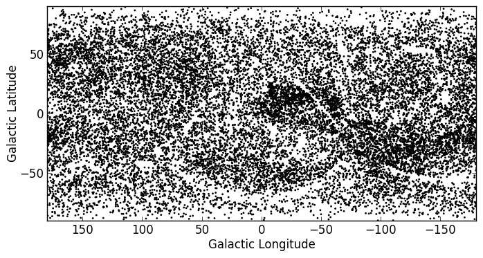

Celestial Coordinates
=====================

Documentation
-------------

For more information about the features presented below, you can read the
`astropy.coordinates <http://docs.astropy.org/en/v0.2/coordinates/index.html>`_ docs.

Representing and converting coordinates
---------------------------------------

Astropy includes a framework to represent celestial coordinates and transform
between them. Astropy 0.2 only includes a few common coordinate systems (ICRS,
FK4, FK5, and Galactic), but future versions will include more built-in
coordinate systems, and users can already define their own systems. In addition,
while the current version only supports transformation of individual scalar
coordinates, arrays will be supported in future.

Coordinate objects are instantiated with a flexible and natural approach that
supports both numeric angle values and (limited) string parsing::

    >>> from astropy import coordinates as coord
    >>> from astropy import units as u
    >>> coord.ICRSCoordinates(ra=10.68458, dec=41.26917, unit=(u.degree, u.degree))
    <ICRSCoordinates RA=10.68458 deg, Dec=41.26917 deg>
    >>> coord.ICRSCoordinates('00h42m44.3s +41d16m9s')
    <ICRSCoordinates RA=10.68458 deg, Dec=41.26917 deg>

The individual components of a coordinate are ``Angle`` objects, and their
values are accessed using special attributes::

    >>> c = coord.ICRSCoordinates(ra=10.68458, dec=41.26917, unit=(u.degree, u.degree))
    >>> c.ra
    <RA 10.68458 deg>
    >>> c.ra.hours
    0.7123053333333333
    >>> c.ra.hms
    (0.0, 42, 44.2992000000001)
    >>> c.dec
    <Dec 41.26917 deg>
    >>> c.dec.radians
    0.7202828960652683

To convert to some other coordinate system, the easiest method is to use
attribute-style access with short names for the built-in systems::

    >>> c.galactic
    <GalacticCoordinates l=121.17422 deg, b=-21.57283 deg>

but explicit transformations via the ``transform_to`` method are also
available::

    >>> c.transform_to(coord.GalacticCoordinates)
    <GalacticCoordinates l=121.17422 deg, b=-21.57283 deg>

The `astropy.coordinates` subpackage also provides a quick way to get coordinates for
named objects (with an internet connection). All coordinate classes have a
special class method, `from_name()`, that accepts a string and queries `Sesame
<http://cds.u-strasbg.fr/cgi-bin/Sesame>`_ to retrieve coordinates for that
object::

    >>> c_eq = coord.ICRSCoordinates.from_name("M16")
    >>> c_eq
    <ICRSCoordinates RA=274.70000 deg, Dec=-13.80670 deg>

This works for any coordinate class::

    >>> c_gal = coord.GalacticCoordinates.from_name("M16")
    >>> c_gal
    <GalacticCoordinates l=16.95408 deg, b=0.79335 deg>

.. note::

    This is intended to be a convenience, and is very simple. If you
    need precise coordinates for an object you should find the appropriate
    reference for that measurement and input the coordinates manually.

Practical Exercises
-------------------

.. admonition::  Excercise 1

    Find the coordinates of the Crab Nebula in ICRS coordinates, and convert
    them to Galactic Coordinates

.. raw:: html

   
Click to Show/Hide Solution
 

::

    >>> from astropy import coordinates as coord
    >>> crab = coord.ICRSCoordinates.from_name('M1')
    >>> print(crab)
    <ICRSCoordinates RA=83.63308 deg, Dec=22.01450 deg>
    >>> crab_gal = crab.transform_to(coord.GalacticCoordinates)
    >>> print(crab_gal)
    <GalacticCoordinates l=-175.44248 deg, b=-5.78434 deg>

.. raw:: html

   

.. admonition::  Excercise 2

    Using the ROSAT Point source catalog (from excercise 1 in :doc:`tables`), convert all the
    equatorial coordinates to Galactic coordinates, and make a new plot (but
    don't worry about the bright sources).

.. raw:: html

   
Click to Show/Hide Solution
 

::

    from astropy import units as u
    from astropy import coordinates as coord
    from astropy.table import Table
    from matplotlib import pyplot as plt

    t = Table.read('rosat.vot', format='votable')

    l = []
    b = []
    for row in t:
        eq = coord.FK5Coordinates(row['RAJ2000'], row['DEJ2000'], unit=(u.degree, u.degree))
        gal = eq.transform_to(coord.GalacticCoordinates)
        l.append(gal.l.degrees)
        b.append(gal.b.degrees)

    fig = plt.figure()
    ax = fig.add_subplot(1,1,1, aspect='equal')
    ax.scatter(l, b, s=1, color='black')
    ax.set_xlim(180., -180.)
    ax.set_ylim(-90., 90.)
    ax.set_xlabel("Galactic Longitude")
    ax.set_ylabel("Galactic Latitude")

    fig.savefig('coord_level2.png', bbox_inches='tight')

.. raw:: html

   

