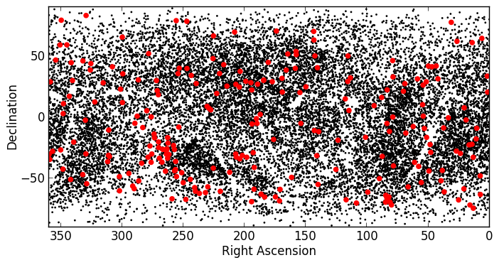

.. _tabular-data:

Tabular data
============

Astropy includes a class for representing arbitrary tabular data in
``astropy.table``, called ``Table``. This class can be imported with::

    from astropy.table import Table

You may need to also import the ``Column`` class, depending on how you are
definining your table (see below)::

    from astropy.table import Table, Column

Documentation
-------------

For more information about the features presented below, you can read the
`astropy.table <http://docs.astropy.org/en/stable/table/index.html>`_ docs.

Constructing and Manipulating tables
------------------------------------

There are a number of ways of constructing tables. One simple way is to start
from existing lists or arrays::

    >>> from astropy.table import Table
    >>> a = [1, 4, 5]
    >>> b = [2.0, 5.0, 8.2]
    >>> c = ['x', 'y', 'z']
    >>> t = Table([a, b, c], names=('a', 'b', 'c'))

There are a few ways to examine the table.  You can get detailed information
about the table values and column definitions as follows::

  >>> t
  <Table rows=3 names=('a','b','c')>
  array([(1, 2.0, 'x'), (4, 5.0, 'y'), (5, 8.2, 'z')],
        dtype=[('a', '<i8'), ('b', '<f8'), ('c', '|S1')])

If you print the table (either from the noteboook or in a text console
session) then a formatted version appears::

  >>> print(t)
    a   b   c
  --- --- ---
    1 2.0   x
    4 5.0   y
    5 8.2   z

Now examine some high-level information about the table::

  >>> t.colnames
  ['a', 'b', 'c']

  >>> len(t)
  3

Access the data by column or row using the same syntax as for Numpy structured
arrays::

    >>> t['a']       # Column 'a'
    <Column name='a' units=None format=None description=None>
    array([1, 4, 5])

    >>> t['a'][1]    # Row 1 of column 'a'
    4

    >>> t[1]         # Row obj for with row 1 values
    <Row 1 of table
      values=(4, 5.0, 'y')
      dtype=[('a', '<i8'), ('b', '<f8'), ('c', '|S1')]>

    >>> t[1]['a']    # Column 'a' of row 1
    4

One can retrieve a subset of a table by rows (using a slice) or columns (using
column names), where the subset is returned as a new table::

    >>> print(t[0:2])      # Table object with rows 0 and 1
     a   b   c
    --- --- ---
      1 2.0   x
      4 5.0   y

    >>> t['a', 'c']  # Table with cols 'a', 'c'
     a   c
    --- ---
      1   x
      4   y
      5   z

Modifying table values in place is flexible and works as one would expect::

    >>> t['a'] = [-1, -2, -3]       # Set all column values
    >>> t['a'][2] = 30              # Set row 2 of column 'a'
    >>> t[1] = (8, 9.0, "W")        # Set all row values
    >>> t[1]['b'] = -9              # Set column 'b' of row 1
    >>> t[0:2]['b'] = 100.0         # Set column 'c' of rows 0 and 1
    >>> print(t)
     a    b    c
    --- ----- ---
     -1 100.0   x
      8 100.0   W
     30   8.2   z

Add, remove, and rename columns with the following::

    >>> t.add_column(Column(data=[1, 2, 3], name='d')))
    >>> t.remove_column('c')
    >>> t.rename_column('a', 'A')
    >>> t.colnames
    ['A', 'b', 'd']

Adding a new row of data to the table is as follows::

    >>> t.add_row([-8, -9, 10])
    >>> len(t)
    4

Lastly, one can create a table with support for missing values, for example by setting
``masked=True``::

    >>> t = Table([a, b, c], names=('a', 'b', 'c'), masked=True)
    >>> t['a'].mask = [True, True, False]
    >>> t
    <Table rows=3 names=('a','b','c')>
    masked_array(data = [(--, 2.0, 'x') (--, 5.0, 'y') (5, 8.2, 'z')],
                 mask = [(True, False, False) (True, False, False) (False, False, False)],
           fill_value = (999999, 1e+20, 'N'),
                dtype = [('a', '<i8'), ('b', '<f8'), ('c', '|S1')])

    >>> print(t)
     a   b   c
    --- --- ---
     -- 2.0   x
     -- 5.0   y
      5 8.2   z

Finally, every table can have meta-data attached to it via the ``meta``
attribute, which can be used like a Python dictionary::

    >>> t.meta['creator'] = 'me'

Reading and writing tables
--------------------------

``Table`` objects include ``read`` and ``write`` methods that can be used to
easily read and write the tables to different formats. The tutorial directory
contains a file named rosat.vot which is the ROSAT All-Sky Bright Source
Catalogue (1RXS) (Voges+ 1999) in the VO Table format.

You can read this in as a ``Table`` object by simply doing::

    >>> t = Table.read('rosat.vot', format='votable')

(just ignore the warnings, which are due to Vizier not complying with the VO
standard). We can see a quick overview of the table with::

    >>> print(t)
         _1RXS        RAJ2000   DEJ2000  PosErr NewFlag   Count    e_Count   HR1  e_HR1  HR2  e_HR2 Extent
    ---------------- --------- --------- ------ ------- --------- --------- ----- ----- ----- ----- ------
    J000000.0-392902   0.00000 -39.48403     19    __..      0.13     0.035  0.69  0.25  0.28  0.24      0
    J000007.0+081653   0.02917   8.28153     10    TT..      0.19     0.021  0.89  0.10  0.24  0.13      0
    J000010.0-633543   0.04167 -63.59528     11    __..      0.19     0.031 -0.36  0.13 -0.35  0.23     13
    J000011.9+052318   0.04958   5.38833      7    __..      0.26     0.026  0.24  0.10  0.00  0.13      0
    J000012.6+014621   0.05250   1.77250     11    __..     0.081     0.016  0.05  0.20  0.00  0.26     14
    J000013.5+575628   0.05625  57.94125      8    __..      0.12     0.017  0.57  0.12  0.32  0.14      0
    J000019.5-261032   0.08125 -26.17556     12    __..      0.12     0.022 -0.26  0.17  0.19  0.29      0
                 ...       ...       ...    ...     ...       ...       ...   ...   ...   ...   ...    ...
    J235929.2-255851 359.87164 -25.98083     10    _T..      0.23     0.028 -0.43  0.11 -0.30  0.26     13
    J235929.3+334329 359.87207  33.72472     11    __..      0.16     0.024 -0.62  0.12 -0.56  0.66     12
    J235930.9-401541 359.87875 -40.26139     18    __..      0.13     0.037 -0.73  0.18  0.02  0.82      0
    J235940.9-314342 359.92041 -31.72847     19    __..     0.058     0.017  0.17  0.30  0.33  0.34      0
    J235941.2+830719 359.92166  83.12195     10    __..     0.066     0.011  0.72  0.14  0.19  0.17      0
    J235944.7+220014 359.93625  22.00389     17    __..     0.052     0.015 -0.01  0.27  0.37  0.35      0
    J235959.1+083355 359.99625   8.56528     10    __..      0.12     0.018  0.54  0.13  0.10  0.17      9

Since we are using IPython with the ``--matplotlib`` option along with 
``import matplotlib.pyplot as plt``, we can easily make a
histogram of the count rates::

    >>> plt.hist(t['Count'], range=[0., 2], bins=100)

.. image:: count_hist.png

It is easy to select a subset of the table matching a given criterion::

    >>> t_bright = t[t['Count'] > 0.2]
    >>> len(t_bright)
    3627

Criteria can be combined::

    >>> t_sub = t[(t['RAJ2000'] > 230.) & (t['RAJ2000'] < 260.) &
                  (t['DEJ2000'] > -60.) & (t['DEJ2000'] < -20)]

    >>> len(t_sub)
    642
    

Practical Exercises
-------------------

.. admonition::  Excercise

    Try and find a way to make a table of the ROSAT point source catalog that
    contains only the RA, Dec, and count rate. Hint: you can see what methods
    are available on an object by typing e.g. ``t.`` and then pressing
    ``<TAB>``. You can also find help on a method by typing e.g.
    ``t.add_column?``.

.. raw:: html

   
Click to Show/Hide Solution
 

::

    >>> t.keep_columns(['RAJ2000', 'DEJ2000', 'Count'])
    >>> print(t)
     RAJ2000   DEJ2000    Count
    --------- --------- ---------
      0.00000 -39.48403      0.13
      0.02917   8.28153      0.19
      0.04167 -63.59528      0.19
      0.04958   5.38833      0.26
      0.05250   1.77250     0.081
      0.05625  57.94125      0.12
      0.08125 -26.17556      0.12
          ...       ...       ...
    359.87207  33.72472      0.16
    359.87875 -40.26139      0.13
    359.92041 -31.72847     0.058
    359.92166  83.12195     0.066
    359.93625  22.00389     0.052
    359.99625   8.56528      0.12
    
    Note that you can also do this with::
    
    >>> t_new = t['RAJ2000', 'DEJ2000', 'Count']
    >>> print(t_new)
     RAJ2000   DEJ2000    Count
    --------- --------- ---------
      0.00000 -39.48403      0.13
      0.02917   8.28153      0.19
      0.04167 -63.59528      0.19
      0.04958   5.38833      0.26
      0.05250   1.77250     0.081
      0.05625  57.94125      0.12
      0.08125 -26.17556      0.12
          ...       ...       ...
    359.87207  33.72472      0.16
    359.87875 -40.26139      0.13
    359.92041 -31.72847     0.058
    359.92166  83.12195     0.066
    359.93625  22.00389     0.052
    359.99625   8.56528      0.12

.. raw:: html

   

.. admonition::  Excercise 2

    Make an all-sky equatorial plot of the ROSAT sources, with all sources
    shown in black, and only the sources with a count rate larger than 2.
    shown in red.

.. raw:: html

   
Click to Show/Hide Solution
 

::

    from astropy.table import Table
    from matplotlib import pyplot as plt

    t = Table.read('rosat.vot', format='votable')
    t_bright = t[t['Count'] > 2.]

    fig = plt.figure()
    ax = fig.add_subplot(1,1,1, aspect='equal')
    ax.scatter(t['RAJ2000'], t['DEJ2000'], s=1, color='black')
    ax.scatter(t_bright['RAJ2000'], t_bright['DEJ2000'], color='red')
    ax.set_xlim(360., 0.)
    ax.set_ylim(-90., 90.)
    ax.set_xlabel("Right Ascension")
    ax.set_ylabel("Declination")

    fig.savefig('tables_level2.png', bbox_inches='tight')

.. raw:: html

   

.. admonition::  Excercise 3

    Try and write out the ROSAT catalog into a format that you can read into
    another software package (see `here
    <http://docs.astropy.org/en/v0.2/table/io.html>`_ for more details). For
    example, try and write out the catalog into CSV format, then read it into
    a spreadsheet software package (e.g. Excel, Google Docs, Numbers,
    OpenOffice).

.. raw:: html

   
Click to Show/Hide Solution
 

To write out the file::

    >>> t.write('rosat2.csv', format='ascii', delimiter=',')

Then you should be able to load it into another software package.

.. raw:: html

   

