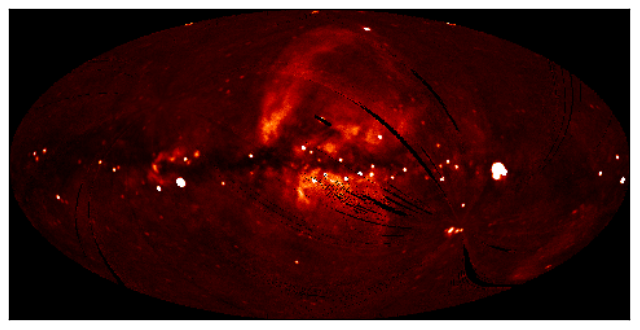

WCS Transformations
===================

.. note:: If you are already familiar with PyWCS, `astropy.wcs` is in fact the
          same code as the latest version of PyWCS, and you can adapt old
          scripts that use PyWCS to use Astropy by simply doing::

              from astropy import wcs as pywcs

          However, for new scripts, we recommend the following import::

              from astropy.wcs import WCS

          since most of the user-level functionality is contained within the `WCS` class.

Documentation
-------------

For more information about the features presented below, you can read the
`astropy.wcs <http://docs.astropy.org/en/v0.2/wcs/index.html>`_ docs.

Data
----

The data used in this page (``ROSAT.fits``) is a map of the Soft X-ray
Diffuse Background from the ROSAT XRT/PSPC in the 3/4 keV band, in an Aitoff
projection:

Representing WCS transformations
--------------------------------

The World Coordinate System standard is often used in FITS files in order to
describe the conversion from pixel to world (e.g. equatorial, galactic, etc.)
coordinates. Given a FITS file with WCS information, such as ``ROSAT.fits``,
we can create an object to represent the WCS transformation either by directly
supplying the filename::

    >>> from astropy.wcs import WCS
    >>> w = WCS('ROSAT.fits')

or the header of the FITS file::

    >>> from astropy.io import fits
    >>> from astropy.wcs import WCS
    >>> header = fits.getheader('ROSAT.fits')
    >>> w = WCS(header)

Pixel to World and World to Pixel transformations
-------------------------------------------------

Once the WCS object has been created, you can use the following methods to
convert pixel to world coordinates::

    >>> wx, wy = w.wcs_pix2world(250., 100., 1)
    >>> print wx, wy
    352.67460912268814 -15.413728717834152

This converts the pixel coordinates (250, 100) to the native world coordinate
system of the transformation. Note the third argument, set to ``1``, which
indicates whether the pixel coordinates should be treated as starting from (1,
1) (as FITS files do) or from (0, 0). Converting from world to pixel
coordinates is similar::

    >>> px, py = w.wcs_world2pix(0., 0., 1)
    >>> print px, py
    240.5 120.5

Working with arrays
-------------------

If many coordinates need to be transformed, then it is possible to use Numpy arrays::

    >>> import numpy as np
    >>> px = np.linspace(200., 300., 10)
    >>> py = np.repeat(100., 10)
    >>> wx, wy = w.wcs_pix2world(px, py, 1)
    >>> print wx
    [  31.31117136   22.6911179    14.09965438    5.52581152  356.9588445
      348.38809541  339.80285857  331.19224432  322.54503641  313.84953796]
    >>> print wy
    [-15.27956026 -15.34691039 -15.39269292 -15.4170814  -15.42016742
     -15.40196251 -15.36239844 -15.30132572 -15.21851046 -15.11362923]

Practical Exercises
-------------------

.. admonition::  Excercise 1

    Try converting more values from pixel to world coordinates, and try
    converting these back to pixel coordinates. Do the results agree with the
    original pixel coordinates? Also, what are the world coordinates of the
    pixel at (1, 1), and why?

.. raw:: html

   
Click to Show/Hide Solution
 

The final pixel coordinates should always agree with the starting ones, since
each pixel covers a unique world coordinate position. The world coordinates of
the pixel at (1, 1) are not defined::

    w.wcs_pix2world(1, 1, 1)
    [array(nan), array(nan)]

because the pixel lies outside the coordinate grid. Thus, not all pixels in an
image have a valid position on the sky.

.. raw:: html

   

.. admonition::  Excercise 2

    Extract and print out the values in the ROSAT map at the position of the LAT
    Point Sources (from the FITS tutorial)

.. raw:: html

   
Click to Show/Hide Solution
 

::

    import numpy as np
    from astropy.io import fits
    from astropy.wcs import WCS
    from astropy.table import Table

    # Read in Point Source Catalog
    data = fits.getdata('gll_psc_v08.fit',1)
    psc = Table(data)

    # Extract Galactic Coordinates
    l = psc['GLON']
    b = psc['GLAT']

    # Read in ROSAT map
    hdulist_im = fits.open('ROSAT.fits')

    # Extract image and header
    image = hdulist_im[0].data
    header = hdulist_im[0].header

    # Instantiate WCS object
    w = WCS(header)

    # Find pixel positions of LAT sources. Note we use ``0`` here for the last
    # argument, since we want zero based indices (for Numpy), not the FITS
    # pixel positions.
    px, py = w.wcs_world2pix(l, b, 0)

    # Find the nearest integer pixel
    px = np.round(px).astype(int)
    py = np.round(py).astype(int)

    # Find the ROSAT values (note the reversed index order)
    values = image[py, px]

    # Print out the values
    print values

which gives::

    [ 123.7635498   163.27642822  221.76609802 ...,  255.07995605  100.35219574
       87.62506104]

.. raw:: html

   

.. admonition::  Level 3

    Make a Matplotlib plot of the image showing gridlines for longitude and
    latitude overlaid (e.g. every 30 degrees).

.. raw:: html

   
Click to Show/Hide Solution
 

::

    import numpy as np
    from matplotlib import pyplot as plt
    from astropy.io import fits
    from astropy.wcs import WCS

    # Read in file
    hdulist = fits.open('ROSAT.fits')

    # Extract image and header
    image = hdulist[0].data
    header = hdulist[0].header

    # Instantiate WCS object
    w = WCS(header)

    # Plot the image
    fig = plt.figure()
    ax = fig.add_subplot(1, 1, 1)
    ax.imshow(image, cmap=plt.cm.gist_heat,
              origin='lower', vmin=0, vmax=1000.)

    # Loop over lines of longitude
    for lon in np.linspace(-180., 180., 13):
        grid_lon = np.repeat(lon, 100)
        grid_lat = np.linspace(-90., 90., 100)
        px, py = w.wcs_world2pix(grid_lon, grid_lat, 1)
        ax.plot(px, py, color='white', alpha=0.5)

    # Loop over lines of latitude
    for lat in np.linspace(-60., 60., 5):
        grid_lon = np.linspace(-180., 180., 100)
        grid_lat = np.repeat(lat, 100)
        px, py = w.wcs_world2pix(grid_lon, grid_lat, 1)
        ax.plot(px, py, color='white', alpha=0.5)

    ax.set_xlim(0, image.shape[1])
    ax.set_ylim(0, image.shape[0])
    ax.set_xticklabels('')
    ax.set_yticklabels('')
    fig.savefig('wcs_extra.png', bbox_inches='tight')

.. image:: wcs_level3.png

.. raw:: html

   

