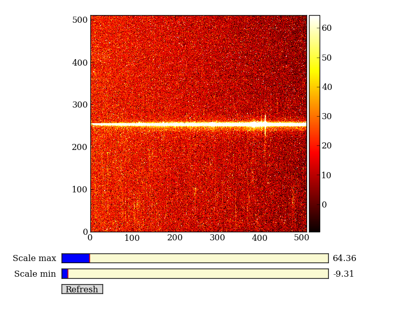
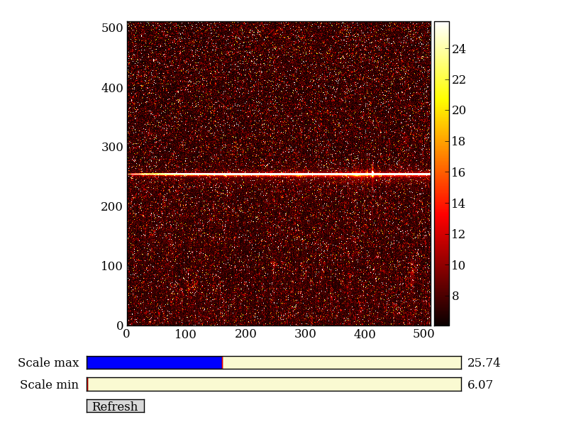
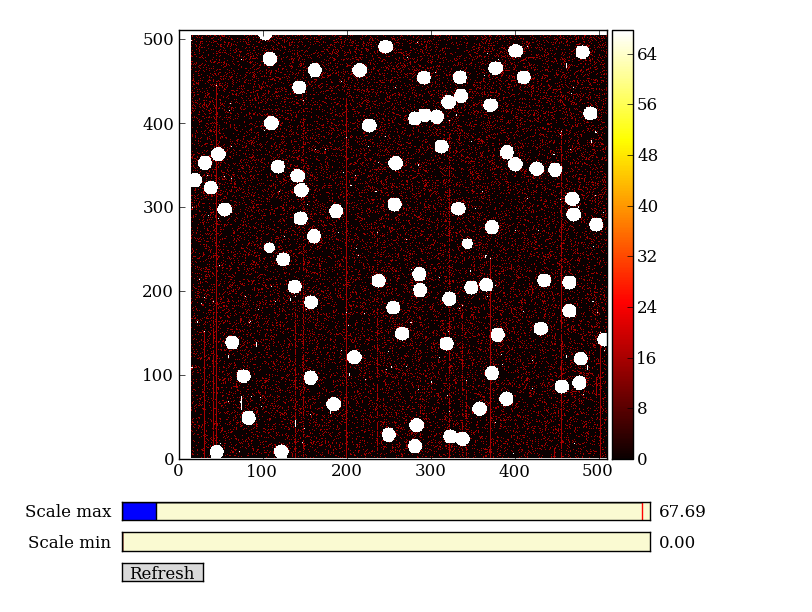
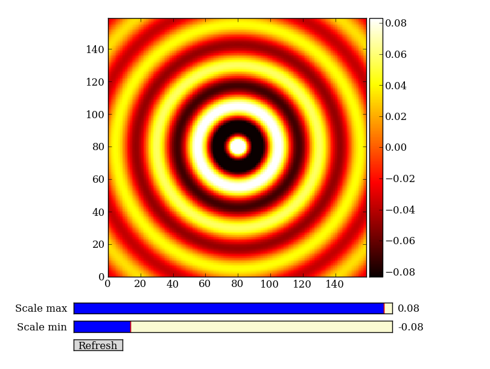
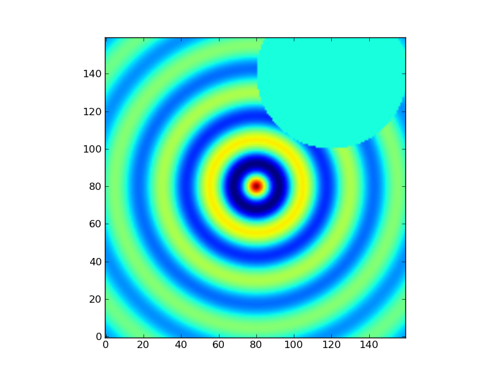
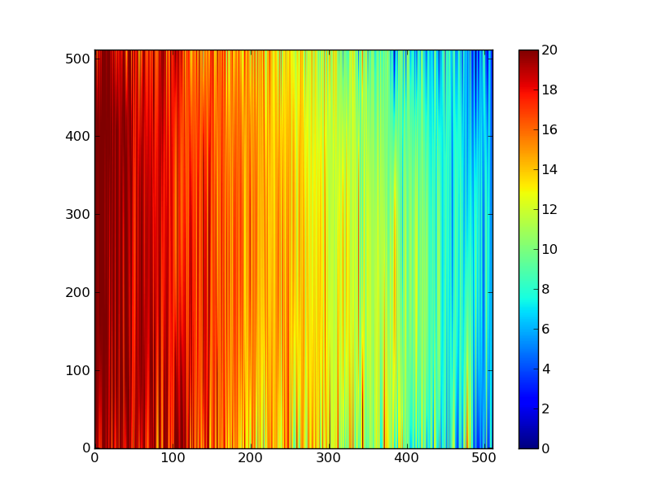

:tocdepth: 2

NumPy
-----

`NumPy`_ is at the core of nearly every scientific Python application or
module since it provides a fast N-d array datatype that can be manipulated in a
vectorized form.  This will be familiar to users of IDL or Matlab.

NumPy has a good and systematic `basic tutorial
<http://www.scipy.org/Tentative_NumPy_Tutorial>`_ available.  It is highly
recommended that you read this tutorial to fill in the gaps left by this
workshop, but on its own it's a bit dry for the impatient astronomer.

Here we'll learn NumPy by performing a very simple reduction of a
2-dimensional long slit spectrum (3C120 from HST/STIS):

- Read in the 2-d image
- Plot the spatial profile and raw spectrum
- Filter cosmic rays from the background
- Fit for the background and subtract
- Sum the source signal

+------------------------------------+-----------------------------------+
|  **2-d longslit image**            |   **Final 1-d spectrum**          |
+====================================+===================================+
| .. image:: 3c120.png               | .. image:: 3c120_spec.gif         |
|    :scale: 70                      |    :scale: 45                     |
+------------------------------------+-----------------------------------+

.. Topics:
   - Appending
   - Median
   - Making arrays
   - Broadcasting x = arange(5); y=x.reshape(5,1) ; x + y * 10
   - diff between list and array
   - vectorized ops (do a for loop)
   - exercise: make a mexican hat or similar
   - boolean masking / where
   - scipy 2-d median filter

Setup
^^^^^^^^

Before going further you need to get the example data and script files for
the workshop.  Now that you have a working Python installation we can do this
without worrying about details of the platform (e.g. linux has wget,
Mac has curl, Windows might not have tar, etc etc).

Now start IPython ("ipython --pylab") or use your existing session and enter::

  import urllib2, tarfile
  url = 'http://python4astronomers.github.com/core/core_examples.tar'
  tarfile.open(fileobj=urllib2.urlopen(url), mode='r|').extractall()
  cd py4ast/core
  ls

Leave this IPython session open for the rest of the workshop.

.. admonition:: Exercise (for the interested reader): How did that code above work?

   Explain what's happening in each part of the previous code snippet to grab
   the file at a URL and untar it.  Google on "python urllib2" and "python
   tarfile" to find the relevant module docs.  Figure out how you would
   use the ``tarfile`` module to create a tarfile.

.. raw:: html

   
Click to Show/Hide Solution
 

- ``urllib2.urlopen(url)`` opens the URL as a streaming file-like object
- ``mode='r|' means ``tarfile`` is expecting a streaming file-like object
  with no ability to seek in the file
- ``tarfile.open(..).extractall`` then extracts the tar archive

Creating a tarfile is left for the reader to solve.

.. raw:: html

   

Read in the 2-d image
^^^^^^^^^^^^^^^^^^^^^^

First read in the long-slit spectrum data.  The standard file format available
for download from `MAST <http://archive.stsci.edu/hst/>`_ is a FITS file with
three identically sized images providing the 2-d spectral intensity, error
values, and data quality for each pixel.  The slit direction is along the rows
(up and down) and wavelength is in columns (left to right).  ::

  import pyfits
  hdus = pyfits.open('3c120_stis.fits.gz')
  hdus

Use the ``?`` to get a little more detail on the ``hdus`` object::

  hdus?

Now give meaningful names to each of the three images that are available in the
FITS HDU list.  You can access element ``n`` in a list with the index ``[n]``,
where the count starts from 0::

  primary = hdus[0].data  # Primary (NULL) header data unit
  img = hdus[1].data      # Intensity data
  err = hdus[2].data      # Error per pixel
  dq = hdus[3].data       # Data quality per pixel

Next have a look at the images using one of the standard Matplotlib plotting
functions::

  plt.imshow(img)

As you can see, it is hard to see things. So, let's set a few option for this
plot. First, we want the origin in the lower left instead of the upper left
corner::

  plt.clf()
  plt.imshow(img, origin = 'lower')

Second, let's change the scaling to something more sensible. By default,
``plt.imshow()`` scales the colorbar from the minimum to the maximum value. In
our case that is not the best option. We can set a lower and upper bound and
add a colorbar to our plot::

  plt.clf()
  plt.imshow(img, origin = 'lower', vmin = -10, vmax = 65)
  plt.colorbar()

Your plot should not look like this (it is possible that the colormap differs,
if your matplotlib has different defaults set).

.. admonition:: Exercise: View the error and data quality images

  Bring up a viewer window for the other two images.  Play with the toolbar
  buttons on the lower-left (hint: try the four on the right first, then
  imagine a web browser for the three on the left).  Does the save button
  work for you?

.. raw:: html

   
Click to Show/Hide Solution
 

::
  
  # Errors
  plt.clf()
  plt.imshow(err, origin = 'lower', vmin = 5, vmax = 25)
  plt.colorbar()
  # Data quality
  plt.clf()
  plt.imshow(dq, origin = 'lower', vmax = 25)
  plt.colorbar()

.. raw:: html

   

Now discover a little bit about the images you have read in, first with ``?``::

  img?

Next use ``help`` and note the slightly different information that you get::

  help img

Use tab completion to see all the methods in short form::

  img.<TAB>

Finally find the shape of the image and its minimum value::

  img.shape  # Get the shape of img
  img.min()  # Call object method min with no arguments

NumPy basics
^^^^^^^^^^^^

Before going further on the spectral extraction project we need to learn about
a few key features of NumPy.

Making arrays
#############

Arrays can be created in different ways. The ">>>" indicates the input to Python::

  >>> a = np.array([10, 20, 30, 40])   # create an array from a list of values
  >>> a
  array([10, 20, 30, 40]

  >>> b = np.arange(4)                 # create an array of 4 integers, from 0 to 3
  >>> b
  array([0, 1, 2, 3]),

  >>> np.arange(0.0, 10.0, 0.1)    # create a float array from 0 to 100 stepping by 0.1
  array([ 0. ,  0.1,  0.2,  0.3,  0.4,  0.5,  0.6,  0.7,  0.8,  0.9,  1. ,
          1.1,  1.2,  1.3,  1.4,  1.5,  1.6,  1.7,  1.8,  1.9,  2. ,  2.1,
          2.2,  2.3,  2.4,  2.5,  2.6,  2.7,  2.8,  2.9,  3. ,  3.1,  3.2,
          3.3,  3.4,  3.5,  3.6,  3.7,  3.8,  3.9,  4. ,  4.1,  4.2,  4.3,
          4.4,  4.5,  4.6,  4.7,  4.8,  4.9,  5. ,  5.1,  5.2,  5.3,  5.4,
          5.5,  5.6,  5.7,  5.8,  5.9,  6. ,  6.1,  6.2,  6.3,  6.4,  6.5,
          6.6,  6.7,  6.8,  6.9,  7. ,  7.1,  7.2,  7.3,  7.4,  7.5,  7.6,
          7.7,  7.8,  7.9,  8. ,  8.1,  8.2,  8.3,  8.4,  8.5,  8.6,  8.7,
          8.8,  8.9,  9. ,  9.1,  9.2,  9.3,  9.4,  9.5,  9.6,  9.7,  9.8,
          9.9]),

  >>> np.linspace(-pi, pi, 5)      # create an array of 5 evenly spaced samples from -pi to pi
  array([-3.14159265, -1.57079633,  0.        ,  1.57079633,  3.14159265]))

New arrays can be obtained by operating with existing arrays::

  >>> a + b**2            # elementwise operations
  array([10, 21, 34, 49])

Arrays may have more than one dimension::

  >>> f = np.ones([3, 4])                 # 3 x 4 float array of ones
  >>> f
  array([[ 1.,  1.,  1.,  1.],
         [ 1.,  1.,  1.,  1.],
         [ 1.,  1.,  1.,  1.]]),

  >>> g = np.zeros([2, 3, 4], dtype=int)  # 3 x 4 x 5 int array of zeros
  array([[[0, 0, 0, 0],
          [0, 0, 0, 0],
          [0, 0, 0, 0]],
         [[0, 0, 0, 0],
          [0, 0, 0, 0],
          [0, 0, 0, 0]]]),

  >>> i = np.zeros_like(f)                # array of zeros with same shape/type as f
  array([[ 0.,  0.,  0.,  0.],
         [ 0.,  0.,  0.,  0.],
         [ 0.,  0.,  0.,  0.]]))

You can change the dimensions of existing arrays::

  >>> w = np.arange(12)
  >>> w.shape = [3, 4]       # does not modify the total number of elements
  array([[ 0,  1,  2,  3],
         [ 4,  5,  6,  7],
         [ 8,  9, 10, 11]]),

  >>> x = np.arange(5)
  >>> x
  array([0, 1, 2, 3, 4]),

  >>> y = x.reshape(5, 1)
  >>> y = x.reshape(-1, 1)  # Same thing but NumPy figures out correct length
  >>> y
  array([[0],
         [1],
         [2],
         [3],
         [4]]))

It is possible to operate with arrays of different dimensions as long as they fit well (broadcasting)::

  >>> x + y * 10
  array([[ 0,  1,  2,  3,  4],
         [10, 11, 12, 13, 14],
         [20, 21, 22, 23, 24],
         [30, 31, 32, 33, 34],
         [40, 41, 42, 43, 44]])

.. admonition:: Exercise: Make a ripple

  Calculate a surface ``z = cos(r) / (r + 5)`` where ``r = sqrt(x**2 +
  y**2)``.  Set ``x`` to an array that goes from -20 to 20 stepping by 0.25
  Make ``y`` the same as ``x`` but "transposed" using the ``reshape`` trick above.
  Use `plt.imshow` to display the image of ``z``.

.. raw:: html

   
Click to Show/Hide Solution
 

::

   x = np.arange(-20, 20, 0.25)
   y = x.reshape(-1, 1)
   r = np.sqrt(x**2 + y**2)
   z = np.cos(r) / (r + 5)
   plt.imshow(z, origin = 'lower)

.. raw:: html

   

Array access and slicing
############################

NumPy provides powerful methods for accessing array elements or particular subsets of an array,
e.g. the 4th column or every other row.  This is called slicing.  The outputs
below illustrate basic slicing, but you don't need to type these examples::

   >>> a = np.arange(20).reshape(4,5)
   >>> a
   array([[ 0,  1,  2,  3,  4],
         [ 5,  6,  7,  8,  9],
         [10, 11, 12, 13, 14],
         [15, 16, 17, 18, 19]])

   >>> a[2, 3]   # select element in row 2, col 3 (counting from 0)
   13

   >>> a[2, :]   # select every element in row 2
   array([10, 11, 12, 13, 14])

   >>> a[:, 0]   # select every element in col 0
   array([ 0,  5, 10, 15])

   >>> a[0:3, 1:3]
   array([[ 1,  2],
          [ 6,  7],
          [11, 12]])

As a first practical
example plot column 300 of the longslit image to look at the spatial profile::

  plt.figure()             # Clear the existing plot -- by default matplotlib overplots.
  plt.plot(img[:, 300])

.. image:: img_col300.png
  :scale: 50

The full slicing syntax also allows for a step size::

  <slice> = i0:i1:step
  array[<slice0>, <slice1>, ...]

- ``i0`` is the first index value (default is zero if not provided)
- ``i1`` is the index upper bound (default is last element index + 1)
- ``step`` is the step size (default is one).  When ``step`` is not specified then the final ":" is not required.

.. admonition:: Exercise: Slice the error array

  - For row 254 of the error array ``err`` plot columns 10 to 200 stepping by 3.
  - Print a rectangular region slice of the data quality with rows 251 to 253 (inclusive) and columns 101 to
    104 (inclusive).  What did you learn about the index upper bound value?

.. raw:: html

   
Click to Show/Hide Solution
 

::

  plt.clf()
  plt.plot(err[254, 10:200:3])
  dq[251:254, 101:105]

The index upper bound ``i1`` is one more than the final index that gets
included in the slice.  In other words the slice includes everything up to,
*but not including*, the index upper bound ``i1``.  There are good reasons for
this, but for now just accept and learn it.

.. image:: err_row254.png
   :scale: 50

.. raw:: html

   

Plot the spatial profile and raw spectrum
^^^^^^^^^^^^^^^^^^^^^^^^^^^^^^^^^^^^^^^^^^

Plot the spatial profile by summing along the wavelength direction::

  profile = img.sum(axis=1)
  plt.figure()
  plt.plot(profile)

Now plot the spectrum by summing along the spatial direction::

  spectrum = img.sum(axis=0)
  plt.figure()
  plt.plot(spectrum)

Since most of the sum is in the background region there is a lot of noise and
cosmic-ray contamination.

.. image:: profile.png
   :scale: 50

.. image:: spectrum_noisy.png
   :scale: 50

.. admonition:: Exercise: Use slicing to make a better spectrum plot

  Use slicing to do the spectrum sum using only the rows in the image where
  there is a signal from the source.
  Hint: zoom into the profile plot to find the right row range.

.. raw:: html

   
Click to Show/Hide Solution
 

::

  spectrum = img[250:260, :].sum(axis=0)
  plt.clf()
  plt.plot(spectrum)

.. image:: spectrum_clean.png
   :scale: 50

.. raw:: html

   

.. Solution

Filter cosmic rays from the background
^^^^^^^^^^^^^^^^^^^^^^^^^^^^^^^^^^^^^^

Plot five columns (wavelength) from the spectrum image as follows::

  plt.clf()
  plt.plot(img[:, 254:259])

.. image:: img_row254_noisy.png
   :scale: 50

The basic idea in spectral extraction is to subtract out the background and sum
over rows with the source signal.

It's evident that there are significant cosmic ray defects in the data.  In
order to do a good job of subtracting the background we need to filter them
out.  Doing this correctly in general is difficult and in reality one would
just use the answers already provided by STSci.

**Strategy**: Use a median filter to smooth out single-pixel deviations.  Then
use sigma-clipping to remove large variations between the actual and smoothed
image.

::

  import scipy.signal
  img_sm = scipy.signal.medfilt(img, 5)
  sigma = median(err)
  bad = np.abs(img - img_sm) / sigma > 8.0
  img_cr = img.copy()
  img_cr[bad] = img_sm[bad]
  img_cr[230:280,:] = img[230:280,:]  # Filter only for background

Check if it worked::

  plt.clf()
  plt.plot(img_cr[:, 254:259])

.. image:: img_row254_clean.png
   :scale: 50

This introduces the important concept of slicing with a **boolean mask**.  Let's
look at a smaller example::

   >>> a = np.array([1, 4, -2, 4, -5])
   >>> neg = (a < 0)    # Parentheses here for clarity but are not required
   >>> neg
   array([False, False,  True, False,  True], dtype=bool)

   >>> a[neg] = 0
   >>> a
   array([1, 4, 0, 4, 0])

A slightly more complex example shows that this works the same on N-d arrays
and that you can compose logical expressions::

   >>> a = np.arange(25).reshape(5,5)
   >>> ok = (a > 6) & (a < 17)     # "ok = a > 6 & a < 17" will FAIL!
   >>> a[~ok] = 0                  # Note the "logical not" operator
   >>> a
   array([[ 0,  0,  0,  0,  0],
          [ 0,  0,  7,  8,  9],
          [10, 11, 12, 13, 14],
          [15, 16,  0,  0,  0],
          [ 0,  0,  0,  0,  0]])

.. admonition:: Exercise [intermediate]: circular region slicing

   Remember the surface ``z = cos(r) / (r + 5)`` that you made previously.  Set
   ``z = 0`` for every pixel of ``z`` that is within 10 units of (x,y) = (10, 15).

.. raw:: html

   
Click to Show/Hide Solution
 

::

  dist = np.sqrt((x-10)**2 + (y-15)**2)
  mask = dist < 10
  z[mask] = 0
  plt.imshow(z, origin = 'lower')

.. raw:: html

   

.. admonition:: Detour: copy versus reference

   **Question**
     In the median filtering commands above we wrote ``img_cr = img.copy()``.  Why
     was that needed instead of just ``img_cr = img``?

   **Answer**
     Because the statement ``img_cr = img`` would just create another reference
     pointing to the underlying N-d array object that ``img`` references.

   Variable names in Python are just pointers to the actual Python
   object.  To see this clearly do the following::

     >>> a = np.arange(8)
     >>> b = a
     >>> id(a)     # Unique identifier for the object referred to by "a": arange(8)
     122333200

     >>> id(b)     # Unique identifier for the object referred to by "b": same ^^
     122333200

     >>> b[3] = -10
     >>> a
     array([  0,   1,   2, -10,   4,   5,   6,   7])

   After getting over the initial confusion this behavior is actually a good
   thing because it is efficient and consistent within Python.  If you really
   need a copy of an array then use the copy() method as shown.

   **BEWARE** of one common pitfall: NumPy "basic" slicing like ``a[3:6]``
   does NOT make a copy::

     >>> b = a[3:6]
     >>> b
     array([-10,   4,   5])

     >>> b[1] = 100
     >>> a
     array([  0,   1,   2, -10, 100,   5,   6,   7])

   However if you do arithmetic or boolean mask then a copy is always made::

     >>> a = np.arange(4)
     >>> b = a**2
     >>> a[1] = 100
     >>> a
     array([  0, 100,   2,   3])

     >>> b    # Still as expected after changing "a"
     array([0, 1, 4, 9])

Fit the background
^^^^^^^^^^^^^^^^^^^^^^^^^^^^^^^^^^^

To subtract the background signal from the source region we want to fit a
quadratic to the background pixels and subtract that quadratic from the entire
image which includes the source region.

Let's tackle a simpler problem first and fit the background for a single column::

  x = append(np.arange(10, 200), np.arange(300, 480))  # Background rows
  y = img_cr[x, 10]         # Background rows of column 10 of cleaned image
  plt.figure()
  plt.plot(x, y)
  pfit = np.polyfit(x, y, 2)   # Fit a 2nd order polynomial to (x, y) data
  yfit = np.polyval(pfit, x)   # Evaluate the polynomial at x
  plt.plot(x, yfit)
  plt.grid()

.. image:: bkg_fit0.png
   :scale: 50

Now do this for every column and store the results in a background image::

  xrows = np.arange(img_cr.shape[0])          # Array from 0 .. N_rows-1
  bkg = np.zeros_like(img_cr)                 # Empty image for background fits
  for col in np.arange(img_cr.shape[1]):      # Iterate over columns
      pfit = np.polyfit(x, img_cr[x, col], 2) # Fit poly over bkg rows for col
      bkg[:, col] = np.polyval(pfit, xrows)   # Eval poly at ALL row positions

  plt.clf()
  plt.imshow(bkg, origin = 'lower', vmin=0, vmax=20)
  plt.colorbar()

Finally subtract this background and see if it worked::

  img_bkg = img_cr - bkg
  plt.clf()
  plt.imshow(img_bkg, origin = 'lower', vmin=0, vmax=60)
  plt.colorbar()

+------------------------------------+-----------------------------------+
|  **Background subtracted**         |   **Original**                    |
+====================================+===================================+
| .. image:: bkg_fit2.png            | .. image:: imgview_img.png        |
|    :scale: 50                      |    :scale: 50                     |
+------------------------------------+-----------------------------------+

.. admonition:: Detour: vector operations versus looping

   If you are used to C or Fortran you might be wondering why jump through these
   hoops with slicing and making sure everything is vectorized.  The answer is
   that pure Python is an interpreted dynamic language and hence doing loops is
   *slow*.   Try the following::

     size = 500000
     x = np.arange(size)
     a = np.zeros(size)
     time for i in x: a[i] = x[i] / 2.0

   Now compare to the vectorized NumPy solution::

     x = np.arange(size)
     time a = x / 2

   Sometimes doing things in a vectorized way is not possible or just too
   confusing.  There is an art here and the basic answer is that if it runs
   fast enough then you are good to go.  Otherwise things need to be vectorized
   or maybe coded in C or Fortran.

.. Solution
   badimg = np.zeros(bad.shape)
   badimg[bad] = 1
   ImgView(badimg)

Sum the source signal
^^^^^^^^^^^^^^^^^^^^^^

Now the final step is easy and is left as an exercise.

+------------------------------------+-----------------------------------+
|**Python for Astronomers Spectrum** |   **HST official spectrum**       |
+====================================+===================================+
| .. image:: spectrum_final.png      | .. image:: 3c120_spec.gif         |
|    :scale: 50                      |    :scale: 45                     |
+------------------------------------+-----------------------------------+

.. admonition:: Exercise: Make the final spectrum

   Sum the rows of the background subtracted spectrum and plot.  Hint: you
   already did it once in a previous exercise.

.. raw:: html

   
Click to Show/Hide Solution
 

::

  spectrum = img_bkg[250:260, :].sum(axis=0)
  plt.clf()
  plt.plot(spectrum)

.. raw:: html

   

**To do**: flux calibration and wavelength calibration!

SciPy
-----

It is impossible to do justice to the full contents of the `SciPy`_ package: is
entirely too large!  What is left as homework for the reader is to
click through to the main `SciPy Reference Manual
<http://docs.scipy.org/doc/scipy/reference/>`_ and skim the `tutorial
<http://docs.scipy.org/doc/scipy/reference/tutorial/index.html>`_.  Keep
this repository of functionality in mind whenever you need some numerical
functionality that isn't in NumPy: there is a good chance it is in SciPy:

- Basic functions in Numpy (and top-level scipy)
- Special functions (scipy.special)
- Integration (scipy.integrate)
- Optimization (optimize)
- Interpolation (scipy.interpolate)
- Fourier Transforms (scipy.fftpack)
- Signal Processing (signal)
- Linear Algebra
- Statistics
- Multi-dimensional image processing (ndimage)
- File IO (scipy.io)
- Weave

