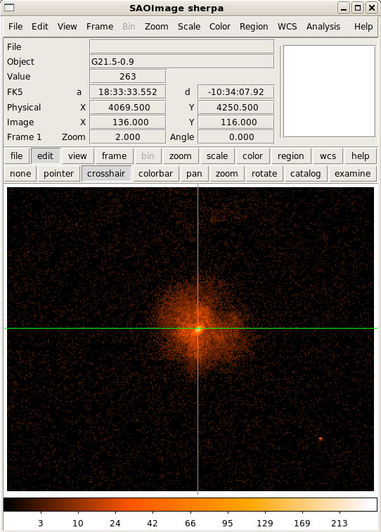
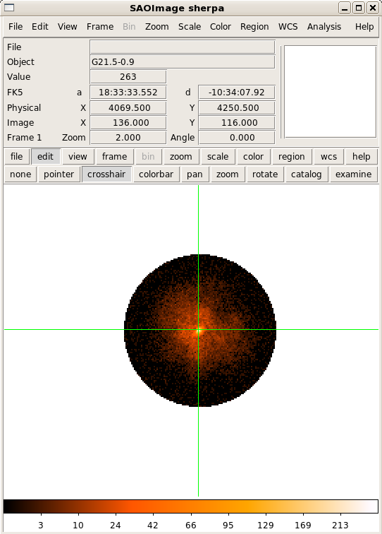
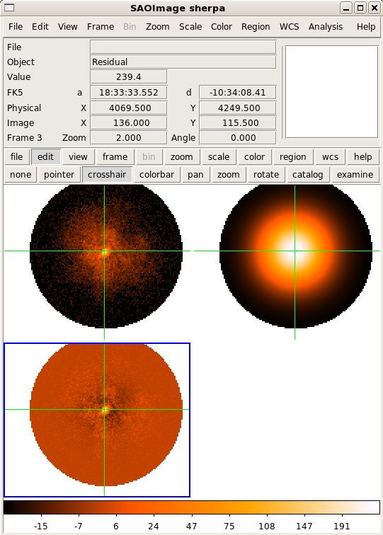

2-D Fitting in Sherpa
---------------------

Fit image data of a supernova remnant G21.5-0.9 using a 2-D multi-component
source model.  First, download the FITS image of :download:`G21.5-0.9 <./image2.fits>` 
and start IPython::

  $ ipython -pylab

If you have trouble accessing the image you can download it straight away using
Python::
  
  import urllib2
  url = "http://python4astronomers.github.com/_downloads/image2.fits"
  open("image2.fits", "wb").write(urllib2.urlopen(url).read())
  ls

Import the Sherpa's high-level UI with added routines for astronomy::

  from sherpa.astro.ui import *

Load in the FITS image using Sherpa's ``load_data``.  Sherpa includes built-in
convienence routines for reading FITS tables and images using pyFITS.  Show the
image using ``image_data`` in DS9::

  load_data("image2.fits")
  image_data()

Calculate the number of source counts in the full FOV::

  calc_data_sum2d()

.. admonition:: Result

  32300

Typically, X-ray data from Chandra contain low counts, so we will switch over
to a maximum likelihood statistic such as `Cash`::

  set_stat("cash")

The default fitting method, least squares, is not suitable for fitting low-count
data such as X-ray images, so we will choose `Simplex` as the optimization
method::

  set_method("simplex")

Set the coordinate system for this image to use `physical` coordinates with
``set_coord`` (Chandra chip coordinates).  Valid coordinate systems include
`image`, `physical`, and `wcs`::

  set_coord("physical")

Next, we will setup a 2-D region to filter the image.  Here we define a 2-D
`CIRCLE` with `x` and `y` defined in physical coordinates and the `radius`
defined in pixels::

  notice2d("CIRCLE(4072.46,4249.34,108)")
  print get_filter()

.. Important::

   The coordinate system of the data must match the coordinate system used in
   the 2-D region definition.  Typically, a call to ``set_coord`` is made before
   using ``notice2d`` or ``ignore2d``.

.. admonition:: Sherpa also supports 2-D regions from file (either ASCII or FITS).

  Sherpa supports CIAO region files to define 2-D noticed regions::

    ignore2d()
    f = file("circle.reg", "w")
    f.write("CIRCLE(4072.46,4249.34,108)\n")
    f.close()

    notice2d("circle.reg")

View the filtered image data in DS9::

  image_data()

Calculate the source counts inside the noticed 2-D region::

  calc_data_sum2d("CIRCLE(4072.46,4249.34,108)")

.. admonition:: Result

  24658

Define a 2-D Gaussian as the source model.  This example is simply an
illustration for describing the source emission.  Initialize the parameter
values according to coordinate system.  The `xpos` and `ypos` parameters are in
`physical` coordinates::

  set_source(gauss2d.g1)
  g1.ampl = 20
  g1.fwhm = 20
  g1.xpos = 4065.5
  g1.ypos = 4250.5

**NOTE:** The function ``set_source`` is synonymous to ``set_model``

Next, constraint the parameter limits to roughly the size of the image::

  g1.fwhm.max = 4300
  g1.xpos.max = 4300
  g1.ypos.max = 4300
  g1.ampl.min = 1
  g1.ampl.max = 1000

View the current model definition and view the 2-D Gaussian in DS9::

  print get_model()
  image_model()

.. image:: g21_model.png
   :scale: 75

Calculate the Gaussian model counts inside the noticed 2-D region::

  calc_model_sum2d("CIRCLE(4072.46,4249.34,108)")

.. admonition:: Result

  2266.1800709135932

Now, include a background component to the source model.  In this case, an
estimate of (0.2) is made from the radial profile::

  set_source(g1+const2d.bgnd)
  bgnd.c0 = 0.2
  bgnd.c0.max = 100

View the updated model expression::

  print get_model()

**NOTE:** The function ``get_model`` is **not** synonymous to ``get_source``.
Typically, Sherpa functions that end in ``_source`` refer to unconvolved model
components (e.g. components to be convolved with a Point Spread Function
(PSF)).  Sherpa functions that end in ``_model`` access the complete convolved
model expression including any convolution components (e.g. PSF).

Fit with ``fit`` and display the data, model, and residuals in DS9 with
``image_fit``::

  fit()
  image_fit()

.. admonition:: Fit Result

  Sherpa fit results include the statistic and method used during fitting,
  goodness-of-fit indicators, the number of function evaluations computed, and
  the list of best-fit parameter values.  NOTE: only the thawed parameters are
  shown.

.. raw:: html
   
  <pre>

Dataset               = 1
Method                = neldermead
Statistic             = cash
Initial fit statistic = 20661.5
Final fit statistic   = -48907.8 at function evaluation 525
Data points           = 9171
Degrees of freedom    = 9166
Change in statistic   = 69569.3
g1.fwhm        57.9477
g1.xpos        4070.4
g1.ypos        4251.11
g1.ampl        23.3562
bgnd.c0        0.266365

.. raw:: html
   
  </pre>

Calculate the model counts inside the noticed 2-D region using the best-fit
parameter values::

  calc_model_sum2d("CIRCLE(4072.46,4249.34,108)")

.. admonition:: Result

  24658.000000637512

Calculate the FWHM in arcseconds using the ACIS conversion factor by accessing
the parameter value with the attribute ``val``::

  g1.fwhm.val * 0.492

.. admonition:: Result

  28.510281281152213

Save the fitted model to a FITS image using ``save_model`` and save the fit
residuals using ``save_resid``::

  save_model("model.fits", clobber=True)
  save_resid("resid.fits", clobber=True)

Calculate the parameter confidence limits on thawed parameter values using the
Sherpa method ``conf``::

  set_conf_opt("sigma", 1.6448536269514722)
  conf()

.. admonition:: Confidence Result

  Sherpa confidence results include the statistic and method used during, a list
  of best-fit parameter values, and their associated confidence limits.  NOTE:
  only the thawed parameters or specified parameters are shown.

.. raw:: html
   
   <pre>

g1.ampl lower bound:    -0.399122
g1.fwhm lower bound:    -0.465406
g1.ampl upper bound:    0.405767
g1.fwhm upper bound:    0.467569
bgnd.c0 lower bound:    -0.0152336
g1.xpos lower bound:    -0.297327
g1.xpos upper bound:    0.297382
g1.ypos lower bound:    -0.294267
g1.ypos upper bound:    0.294294
bgnd.c0 upper bound:    0.0156245
Dataset               = 1
Confidence Method     = confidence
Iterative Fit Method  = None
Fitting Method        = neldermead
Statistic             = cash
confidence 1.64485-sigma (90%) bounds:
Param            Best-Fit  Lower Bound  Upper Bound
=====            ========  ===========  ===========
g1.fwhm           57.9477    -0.465406     0.467569
g1.xpos            4070.4    -0.297327     0.297382
g1.ypos           4251.11    -0.294267     0.294294
g1.ampl           23.3562    -0.399122     0.405767
bgnd.c0          0.266365   -0.0152336    0.0156245

.. raw:: html
   
   </pre>

.. admonition:: Exercise (for the interested reader): SciPy special functions

  Sherpa does not yet support the feature to indicate the confidence as a
  percentage.  How can we convert the desired percentage to the sigma that
  Sherpa supports?

  (Hint): Try ``scipy.special.erfinv``

.. raw:: html
   
   

Typically, the confidence is calculated from sigma using the error-function,
ERF(sigma/SQRT(2)).  We can invert this operation using the inverse
error-function found in SciPy in the special functions module::

  import scipy.special
  print scipy.special.erfinv(0.90)*numpy.sqrt(2)

.. raw:: html

   
 
Click to Show/Hide Solution

Notice how the parameter confidence limits are displayed as soon as they are
known.  The parameter confidence limits are accessed using ``get_conf_results``.
Save the 90% calculated parameter limits::

  results = get_conf_results()
  f = file("fit_results.out", "w")
  f.write("NAME VALUE MIN MAX\n")
  for name, val, minval, maxval in zip(results.parnames,results.parvals,results.parmins,results.parmaxes):
      line = [name, str(val), str(val+minval), str(val+maxval)]
      print line
      f.write(" ".join(line)+"\n")

  f.close()

View the new output file::

  !cat fit_results.out

Notice how the function ``zip`` rotates the list of tuples into rows of names,
values, min values, and max values::

  tbl = zip(results.parnames,results.parvals,results.parmins,results.parmaxes)
  print tbl[0]
  name, val, min, max = tbl[0]
