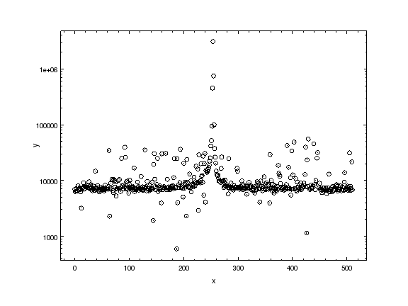
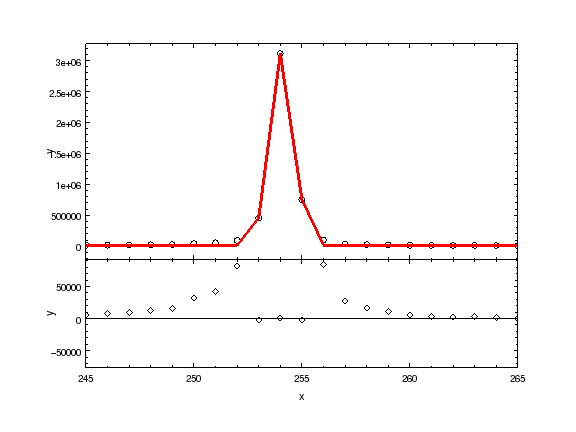

Sherpa Overview
---------------

`Sherpa <http://cxc.harvard.edu/sherpa>`_ is a general purpose modeling and fitting application written in Python.

- Uses Python's interactive capabilities and its Object Oriented Programming
  (OOP) approach.

- Provides a flexible environment for resolving spectral and image properties,
  analyzing time series, and modeling generic types of data.

- Implements the forward fitting technique for parametrized data modeling.

- Includes functions to calculate goodness-of-fit and parameter confidence
  limits.

- Data structures are contained in Python modules so users can easily add their
  own data structures, models, statistics or optimization methods to Sherpa.

- Complex model expressions are supported using a general purpose and compact
  definition syntax.

- Has a high-level UI that deals with a lot of the data management
  and general book-keeping you come across, but the low-level API
  can also be used (e.g. as part of a separate application).

In this tutorial we will show you how Sherpa can be used to model and
fit 1D data (without and with errors) and 2D images. Higher
dimensionality data is supported (to some extent) but there is no
documentation. The 1D examples are for "unbinned" data, but you can
also handle the case where the model has to be summed (integrated)
across each bin (for the 2D case we treat image data as point/unbinned
for convenience and speed).

Documentation
^^^^^^^^^^^^^

- `Sherpa home page
  <http://cxc.harvard.edu/sherpa>`_: Sherpa for CIAO users
- `Sherpa python page
  <http://cxc.harvard.edu/contrib/sherpa>`_: Sherpa for Python users

The Sherpa documentation collection includes a gallery of examples, fitting
threads, and AHELP pages that describe each Sherpa function:

- `Sherpa gallery
  <http://cxc.cfa.harvard.edu/sherpa/gallery/thumbnails.py.html>`_: Examples by plot
- `Sherpa fitting threads
  <http://cxc.cfa.harvard.edu/sherpa/threads/index.html>`_: Example scripts
- `Sherpa AHELP pages
  <http://cxc.cfa.harvard.edu/sherpa/ahelp/index_alphabet.html>`_: Function information

Load data into Sherpa
^^^^^^^^^^^^^^^^^^^^^

If you still have the 3C120 data from the 
`NumPy introduction <../core/numpy_scipy.html#setup>`_
then go to the py4ast/core directory, otherwise ::

  $ ipython --matplotlib

  from astropy.extern.six.moves.urllib import request
  import tarfile
  url = 'http://python4astronomers.github.com/core/core_examples.tar'
  tarfile.open(fileobj=request.urlopen(url), mode='r|').extractall()
  cd py4ast/core

Now we load the Sherpa UI module and other requirements::

  import sherpa.astro.ui as ui
  import numpy as np
  from astropy.io import fits
  # import pycrates
  # import pychips

and then the data, using the ``load_arrays`` command ::

  img = fits.open('3c120_stis.fits.gz')[1].data
  # cr = pycrates.read_file('3c120_stis.fits.gz')
  # img = pycrates.get_piximgvals(cr)
  profile = img.sum(axis=1)
  xaxis = np.arange(profile.size)
  ui.load_arrays(1, xaxis, profile)
  ui.plot_data()
  # pychips.log_scale(pychips.Y_AXIS)

.. Note::
  I will be using the CIAO version of Sherpa for the demonstation, but
  feel free to use the standalone version. Here we load the data into
  dataset number ``1`` (which is the default); data set ids can be
  integers or strings (for example "src" and "bgnd"). Some routines
  work on a single dataset and some on all; for some commands
  the id value can be left out to use the default (``plot_data``
  is and ``load_arrays`` isn't).

.. Hint::
  Try out ``d1 = ui.get_data()`` and ``dir(d1)``.

Set up the model
^^^^^^^^^^^^^^^^

The aim is to determine the approximate spatial extent of the profile,
so we start with a gaussian: ::

  ui.set_source(ui.gauss1d.g1)
  print(g1)
  gauss1d.g1
     Param        Type          Value          Min          Max      Units
     -----        ----          -----          ---          ---      -----
     g1.fwhm      thawed           10  1.17549e-38  3.40282e+38           
     g1.pos       thawed            0 -3.40282e+38  3.40282e+38           
     g1.ampl      thawed            1 -3.40282e+38  3.40282e+38           

.. Note::
  The Sherpa UI uses fancy Python magic to create a variable with
  the name of the model component - in this case ``g1`` - which is
  then used to read and modify the model parameters. Parameters
  have a value, range, and can be thawed (can be adjusted during
  a fit) or frozen (will not be fixed).

.. Hint::
  Try out ``dir(g1)``. As shown below, the source expression
  can be retrieved with ``ui.get_source``.

It would be nice if the optimizer were guaranteed to find the
best fit no matter where you start (and the quality of the data), 
but it often helps to try and give the system a helping hand.
One way to do this is via the ``guess`` command, which
uses simple heuristics to initialize some of the
parameter values and ranges (the algorithm used depends on
the model). ::

  ui.freeze(g1.fwhm)
  ui.guess(g1)
  ui.thaw(g1.fwhm)
  print(g1)
  gauss1d.g1
     Param        Type          Value          Min          Max      Units
     -----        ----          -----          ---          ---      -----
     g1.fwhm      thawed           10  1.17549e-38  3.40282e+38           
     g1.pos       thawed          254            0          511           
     g1.ampl      thawed  3.11272e+06      3112.72  3.11272e+09           

.. Note::
  The reason for freezing the ``fwhm`` parameter before the ``guess``
  is to avoid a strange error message
  (``ParameterErr: parameter g1.fwhm
  has a hard minimum of 1.17549e-38``) that is specific to the
  ``gauss1d`` model.

Selecting a statistic and optimizer
^^^^^^^^^^^^^^^^^^^^^^^^^^^^^^^^^^^

For this dataset we have no errors so use the least-squared statistic,
and the default optimizer (the Levenberg-Marquardt method).
Other choices for the statistic are gaussian - with a range of error
estimates - or Cash, and optimizers are Simplex and a Monte-Carlo
based method. Some situations require a particular choice, but
it can be useful to change values to check that you
are at the best-fit location (or, to avoid the wrath of any
Statistician, the local minimum). ::

  ui.set_stat('leastsq')
  print(ui.get_method())
  name    = levmar
  ftol    = 1.19209289551e-07
  xtol    = 1.19209289551e-07
  gtol    = 1.19209289551e-07
  maxfev  = None
  epsfcn  = 1.19209289551e-07
  factor  = 100.0
  verbose = 0

.. Note::
  The parameters for the optimizers (e.g. ``ftol`` for ``levmar``)
  should be left alone unless you get *really* stuck **and** know
  what you are doing.

Now the fit
^^^^^^^^^^^

For this example, the fit is quick (it does not take many iterations)::

  ui.fit()
  Dataset               = 1
  Method                = levmar
  Statistic             = leastsq
  Initial fit statistic = 5.46696e+13
  Final fit statistic   = 9.55741e+10 at function evaluation 34
  Data points           = 512
  Degrees of freedom    = 509
  Change in statistic   = 5.4574e+13
     g1.fwhm        1.28959     
     g1.pos         254.075     
     g1.ampl        3.14129e+06
   
and we repeat just to make sure::

  ui.fit()
  Dataset               = 1
  Method                = levmar
  Statistic             = leastsq
  Initial fit statistic = 9.55741e+10
  Final fit statistic   = 9.55741e+10 at function evaluation 5
  Data points           = 512
  Degrees of freedom    = 509
  Change in statistic   = 0
     g1.fwhm        1.28959     
     g1.pos         254.075     
     g1.ampl        3.14129e+06 

.. Note::
  The exact values you get depend on both the OS and build type
  (32 vs 64 bit).

.. Hint::
  The ``fit`` command will fit all loaded datasets when called
  with no id; use ``fit(1)`` to fit a single dataset.
  The screen output from the ``fit`` command can also be
  retrieved as a structure (a Python object) using the
  ``ui.get_fit_results()`` command.

View the fit
^^^^^^^^^^^^

The fit can be viewed graphically (the warnings can be ignored)::

  ui.plot_fit()
  WARNING: unable to calculate errors using current statistic: leastsq
  ui.plot_fit_resid()
  WARNING: unable to calculate errors using current statistic: leastsq
  WARNING: unable to calculate errors using current statistic: leastsq
  # pychips.limits(pychips.X_AXIS, 245, 265)

.. image:: 3c120_fit_resid1.png
   :scale: 75

.. Hint::
  The level of screen output created by Sherpa can be controlled
  using the `Python logging module <http://docs.python.org/library/logging.html>`_.
  Unless you
  have used a similar library in another language, it will appear
  needlessly complex (as it does a lot) and we unfortunately don't have time to discuss it here.

Adding a component
^^^^^^^^^^^^^^^^^^

We can re-use existing components in a source expression::

  ui.set_source(g1 + ui.const1d.bgnd)
  print(ui.get_source())
  (gauss1d.g1 + const1d.bgnd)
     Param        Type          Value          Min          Max      Units
     -----        ----          -----          ---          ---      -----
     g1.fwhm      thawed      1.28959  1.17549e-38  3.40282e+38           
     g1.pos       thawed      254.075            0          511           
     g1.ampl      thawed  3.14129e+06      3112.72  3.11272e+09           
     bgnd.c0      thawed            1            0  3.40282e+38           

Rather than using ``guess``, let's see how well the optimizer does::

  ui.fit()
  Dataset               = 1
  Method                = levmar
  Statistic             = leastsq
  Initial fit statistic = 9.55644e+10
  Final fit statistic   = 4.96699e+10 at function evaluation 16
  Data points           = 512
  Degrees of freedom    = 508
  Change in statistic   = 4.58945e+10
     g1.fwhm        1.28402     
     g1.pos         254.076     
     g1.ampl        3.1326e+06  
     bgnd.c0        9497.67     

  ui.fit()
  Dataset               = 1
  Method                = levmar
  Statistic             = leastsq
  Initial fit statistic = 4.96699e+10
  Final fit statistic   = 4.96699e+10 at function evaluation 6
  Data points           = 512
  Degrees of freedom    = 508
  Change in statistic   = 0
     g1.fwhm        1.28402     
     g1.pos         254.076     
     g1.ampl        3.1326e+06  
     bgnd.c0        9497.67     

  ui.plot_fit_resid()
  # pychips.limits(pychips.X_AXIS, 245, 265)

 
Evaluating the model expression directly
^^^^^^^^^^^^^^^^^^^^^^^^^^^^^^^^^^^^^^^^

Model components and source expressions can be evaluated directly,
although this approach only works for simple models; that is those
without convolution (either explicitly via ``ui.set_psf`` or implictly
as happens with the handling of the response information in X-ray
data).::

  xi = np.arange(250, 260)
  src = ui.get_source()
  yi = src(xi)

  zip(xi, yi)
  [(250, 9497.6705120244224),
   (251, 9498.0568224326398),
   (252, 11732.300774634092),
   (253, 457003.64642740792),
   (254, 3112045.5828799075),
   (255, 754169.02805867838),
   (256, 15685.485177760009),
   (257, 9499.4505770869582),
   (258, 9497.6705274404576),
   (259, 9497.6705097123686)]

.. Note::
  The ``zip`` command is one of those utility functions that
  comes in really handy.

.. Hint::
  There are a family of commands, such as ``ui.get_data_plot``,
  ``ui.get_model_plot``, and ``ui.get_fit_plot`` which provide
  access to the data used to create the corresponding plot command.
  This is one way to handle those models which include a convolution
  component.

I want to find those columns that are significantly higher than
the background, so let's try ``bgnd.c0 + 5``::

  print(xi[yi > bgnd.c0 + 5])
  []

Well, that was unexpected! So what went wrong?::

  bgnd.c0 + 5
  <BinaryOpParameter '(bgnd.c0 + 5)'>

In order to support linked parameters
(demonstrated in the `next section <spectrum.html>`), and a
bunch of other sparkly goodness, the
value `bgnd.c0` is actually a Python object. To get at its value
you have to use the ``val`` field::

  bgnd.c0
  <Parameter 'c0' of model 'bgnd'>
  bgnd.c0.val
  9497.6705097123631
  bgnd.c0.val + 5
  9502.6705097123631
  print(xi[yi>bgnd.c0.val + 5])
  [252 253 254 255 256]
  
Saving the session
^^^^^^^^^^^^^^^^^^

The ``save`` command can be used to store the
current session as a single file.::

  ui.save("3c120.sherpa")

This file can then be
loaded into a new session with the ``restore`` command.::

  $ ipython --matplotlib

  In [1]: import sherpa.astro.ui as ui
  
  In [2]: ui.restore("simple1.sherpa")
   Solar Abundance Vector set to angr:  Anders E. & Grevesse N. Geochimica et Cosmochimica Acta 53, 197 (1989)
   Cross Section Table set to bcmc:  Balucinska-Church and McCammon, 1998
  
  In [3]: ui.show_all()
  Data Set: 1
  Filter: 0.0000-511.0000 x
  name      = 
  x         = Int64[512]
  y         = Float32[512]
  staterror = None
  syserror  = None
  
  Model: 1
  (gauss1d.g1 + const1d.bgnd)
     Param        Type          Value          Min          Max      Units
     -----        ----          -----          ---          ---      -----
     g1.fwhm      thawed      1.28402  1.17549e-38  3.40282e+38           
     g1.pos       thawed      254.076            0          511           
     g1.ampl      thawed   3.1326e+06      3112.72  3.11272e+09           
     bgnd.c0      thawed      9497.67            0  3.40282e+38           
  
  Optimization Method: LevMar
  name    = levmar
  ftol    = 1.19209289551e-07
  xtol    = 1.19209289551e-07
  gtol    = 1.19209289551e-07
  maxfev  = None
  epsfcn  = 1.19209289551e-07
  factor  = 100.0
  verbose = 0
  
  Statistic: LeastSq
  Least Squared
  
  Fit:Dataset               = 1
  Method                = levmar
  Statistic             = leastsq
  Initial fit statistic = 4.96699e+10
  Final fit statistic   = 4.96699e+10 at function evaluation 6
  Data points           = 512
  Degrees of freedom    = 508
  Change in statistic   = 0
     g1.fwhm        1.28402     
     g1.pos         254.076     
     g1.ampl        3.1326e+06  
     bgnd.c0        9497.67     
  
.. Note::
  The ``save`` command takes advantage of Python's pickling
  capabilities. The result is a binary file that can be shared between
  machines, even on a different OS or - I believe - 32 and 64 bit
  variants. This makes sharing fits with colleagues very easy
  - e.g. via DropBox - but has some downsides: it is not guaranteed
  that the files can be used with different versions of Sherpa;
  you can't manually inspect the file to see what was done;
  and those people implementing advanced features 
  (e.g. user models or statistics) may not 
  support this functionality. The ``ui.save_all`` command
  writes out a Python script, but it is aimed mainly at users who
  load in data from files rather than with the ``load_arrays``
  command.
