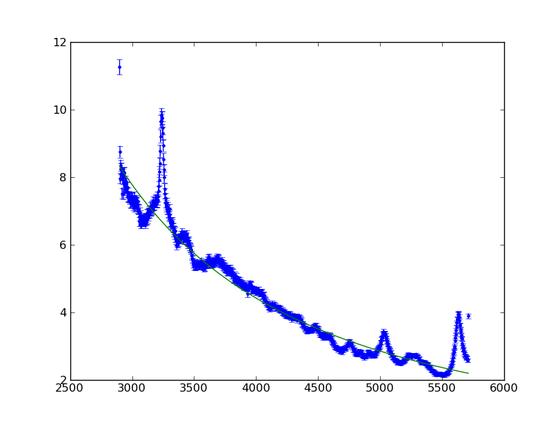

Sherpa Overview
---------------

`Sherpa <http://cxc.harvard.edu/sherpa>`_ is a general purpose modeling and fitting application written in Python.

  - Uses Python's interactive capabilities and its Object Oriented Programming
    (OOP) approach.

  - Provides a flexible environment for resolving spectral and image properties,
    analyzing time series, and modeling generic types of data.

  - Implements the forward fitting technique for parametrized data modeling.

  - Includes functions to calculate goodness-of-fit and parameter confidence
    limits.

  - Data structures are contained in Python modules so users can easily add their
    own data structures, models, statistics or optimization methods to Sherpa.

  - Complex model expressions are supported using a general purpose and compact
    definition syntax.

Documentation
^^^^^^^^^^^^^

- `Sherpa home page
  <http://cxc.harvard.edu/sherpa>`_: Sherpa for CIAO users
- `Sherpa python page
  <http://cxc.harvard.edu/contrib/sherpa>`_: Sherpa for Python users

The Sherpa documentation collection includes a gallery of examples, fitting
threads, and AHELP pages that describe each Sherpa function:

- `Sherpa gallery
  <http://cxc.cfa.harvard.edu/sherpa/gallery/thumbnails.py.html>`_: Examples by plot
- `Sherpa fitting threads
  <http://cxc.cfa.harvard.edu/sherpa/threads/index.html>`_: Example scripts
- `Sherpa AHELP pages
  <http://cxc.cfa.harvard.edu/sherpa/ahelp/index_alphabet.html>`_: Function information

Explore the Sherpa Object Model
^^^^^^^^^^^^^^^^^^^^^^^^^^^^^^^

In a new working directory, download a MAST spectrum of :download:`3C 273 <./3c273.fits>` 
and start IPython::

  $ ipython -pylab

If you have trouble accessing the spectrum you can download it straight away
using Python::
  
  import urllib2
  url = 'http://python4astronomers.github.com/_downloads/3c273.fits'
  open('3c273.fits', 'wb').write(urllib2.urlopen(url).read())
  ls

Import a few Sherpa classes needed to characterize a fit::

  from sherpa.data import Data1D
  from sherpa.models import PowLaw1D
  from sherpa.stats import Chi2DataVar
  from sherpa.optmethods import LevMar
  from sherpa.fit import Fit

Import the Python FITS reader ``pyfits`` and open the spectrum as a table::

  import pyfits
  dat = pyfits.open('3c273.fits')[1].data

Access the `WAVELENGTH` and `FLUX` columns from the pyFITS ``RecArray``.  Populate
variables represented as ``wave``, ``flux``, and ``err``.  Normalize the flux and assume
uncertainties of 2% of the flux::

  wave = dat.field('WAVELENGTH')
  flux = dat.field('FLUX') * 1e14
  err  = dat.field('FLUX') * 0.02e14

Create a Sherpa ``Data1D`` data set from the NumPy arrays ``wave``, ``flux``, and
``err``.  The data arrays are accessible from the ``data`` object as the attributes
``x``, ``y``, and ``staterror``::

  data = Data1D('3C 273', wave, flux, err)
  print data

Array access::

  print 'x', data.x
  print 'y', data.y
  print 'err',  data.staterror

Define a convenience function ``plot_data`` that calls the matplotlib functions
``plot`` and ``errorbar`` according to certain criteria.  Plot the ``x`` and
``y`` arrays using the format specified in the optional argument, ``fmt``.
Clear the plot if the ``clear`` argument is ``True``.  Add the plot errorbars if
the ``err`` array is present.  Plot the spectrum by accessing the NumPy arrays
in the Sherpa data set using our new function and its default arguments::

  def plot_data(x, y, err=None, fmt='.', clear=True):
      if clear:
          clf()
      plot(x, y, fmt)
      if err is not None:
          errorbar(x, y, err, fmt=None, ecolor='b')

  plot_data(data.x, data.y, data.staterror)

.. image:: 3c273_data_mast.png
   :scale: 75

Create a Sherpa power-law model ``pl``.  All Sherpa models maintain a tuple of
parameters in ``pars``.  Access each of the model's parameter objects and print
the ``name`` and ``val`` attributes::

  pl = PowLaw1D('pl')
  pl.pars
  for par in pl.pars:
      print par.name, par.val

  print pl

Set the power-law reference to be 4000 Angstroms and print out the ``PowLaw1D``
object and its parameter information.  Each model parameter is accessible as an
attribute its model.  For example, the power-law amplitude is referenced with
``pl.ampl``::

  pl.ref = 4000.
  print pl

Model parameters are themselves class objects::

  print pl.ampl

.. admonition:: Exercise (for the interested reader): Special methods and properties

  Wait. Didn't we just set ``pl.ref`` to be an float?  How can ``pl.ref`` be an
  float and a ``Parameter`` object?

.. raw:: html
   
   

The answer is that pl.ref is in fact an object, but its model class supports a
special setter method ``__setattr__()`` that updates the pl.ref.val attribute
underneath.  The ``property`` function defines custom getter and setter
functions for a particular class attribute::

  class Parameter(object):
      def __init__(self):
          # private attribute intended to be reference as 'val'.
          self._value = 1.0

      def _get_val(self): return self._value
      def _set_val(self, value): self._value = value
      # setup a 'val' attribute
      val = property(_get_val, _set_val)

  class Model(object):
      def __setattr__(self, name, val):
          if isinstance(getattr(self, name, None), Parameter):
              getattr(self, name).val = val
          else:
              object.__setattr__(self, name, val)
      def __init__(self):
          self.ref = Parameter()

  m = Model()
  m.ref
  m.ref = 4
  m.ref
  m.ref.val

.. raw:: html
   
   
 
Click to Show/Hide Solution

Create a ``Fit`` object made up of a Sherpa data set, model, fit statistic, and
optimization method.  Fit the spectrum to a power-law with least squares
(Levenberg-Marquardt) using the chi-squared statistic with data variance::

  f = Fit(data, pl, Chi2DataVar(), LevMar())
  result = f.fit()
  print result
  # or alternatively
  print result.format()

Over-plot the fitted model atop the data points using our convenience function
``plot_data``.  This time calculate the model using the best-fit parameter
values over the ``data.x`` and plot using a custom format and indicate
``clear=False``::

  plot_data(data.x, pl(data.x), fmt="-", clear=False)

