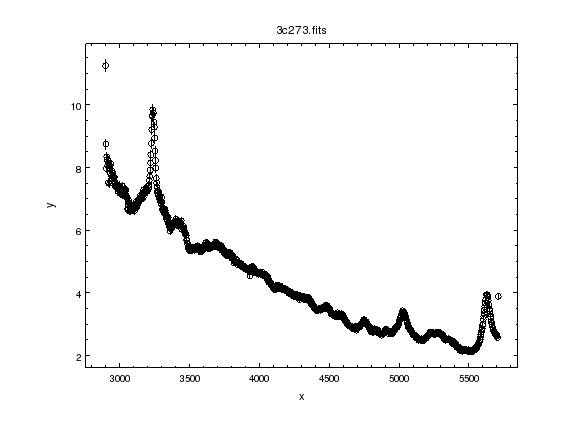
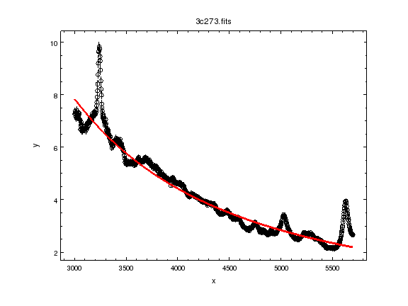
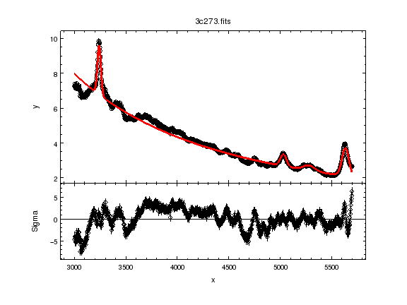
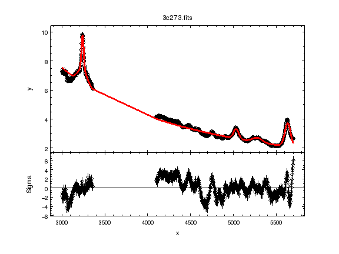
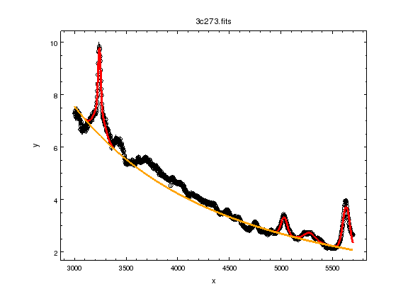
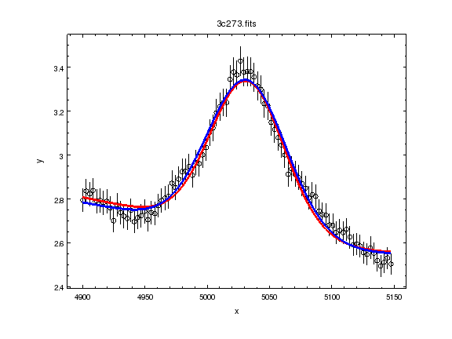
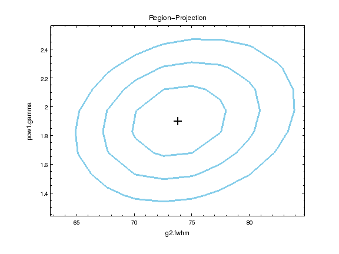

1-D data with errors
--------------------

Here we are going to fit a 1-D spectrum with errors, so our input will be
three arrays: x values, y values, and errors on the y values.

In a new working directory, download a MAST spectrum of :download:`3C 273 <./3c273.fits>`
and start IPython ::

  $ ipython --pylab

If you have trouble accessing the spectrum you can download it straight away
using Python  ::

  import urllib2
  url = 'http://python4astronomers.github.com/_downloads/3c273.fits'
  open('3c273.fits', 'wb').write(urllib2.urlopen(url).read())

We also need to load in Sherpa ::

  import sherpa.ui as ui
  import numpy as np

Loading the data
^^^^^^^^^^^^^^^^

::

  ui.load_data('3c273.fits')
  print(ui.get_data())
  name      = 3c273.fits
  x         = Float64[1024]
  y         = Float64[1024]
  staterror = None
  syserror  = None

.. Note::
  The ``load_data`` command may not work in the stand-alone version of
  Sherpa. If not, you can use `astropy.io.fits`_ to load in the data and then
  ``load_arrays``, for example::

    from astropy.io import fits
    dat = fits.open('3c273.fits')[1].data
    wlen = dat.field('WAVELENGTH')
    flux = dat.field('FLUX')
    ui.load_arrays(1, wlen, flux)

As the file contains two columns, they are taken to be the ``x`` and
``y`` data values. The y values are small (of order 10^-14): ::

  ui.get_data().y.mean()
  4.3317031058773416e-14
  np.ptp(ui.get_data().y)
  9.1256637866471944e-14

.. Note::
  The numpy ptp routine returns the range of the data, and is short
  for "peak to peak".

Re-scaling the data
^^^^^^^^^^^^^^^^^^^

Whilst Sherpa can deal with small (and large) values, it can be
visually
easier to deal with values closer to unity, so we re-scale the data
values: ::

  d1 = ui.get_data()
  d1.y *= 1e14

.. Note::
  I am taking advantage of Sherpa's use of python objects to directly
  change the y values of the data. 

and add in errors (for the sake of this example we assume a 2 percent
error on each data point). ::

  d1.staterror == None
  True
  ui.set_staterror(0.02, fractional=True)
  d1.staterror == None
  False
  ui.plot_data()

.. Hint::
  I could have used ``d1.staterror = 0.02 * d1.y`` instead of the
  ``set_staterror`` command.

.. Note::
  Sherpa supports both statistical and systematic errors. Here we
  will be dealing with statistical errors only.

Filtering the data
^^^^^^^^^^^^^^^^^^

It can be useful to only fit a subset of the data - e.g. to
concentrate on a particular feature - and then go back and fit
all the data. The Sherpa commands are ``notice`` and ``ignore``. ::

  ui.notice(3000, 5700)

From this point the extra data will not be used by Sherpa, whether
in a fit or a plot command.

.. Hint::
  Try ``ui.plot_data()`` and compare the results to the original plot.

Fitting the continuum
^^^^^^^^^^^^^^^^^^^^^

We start with a powerlaw model, with a normalization defined
at 4000 Angstroms. ::

  ui.set_source(ui.powlaw1d.pow1)
  pow1.ref = 4000.0
  print(pow1)
  powlaw1d.pow1
     Param        Type          Value          Min          Max      Units
     -----        ----          -----          ---          ---      -----
     pow1.gamma   thawed            1          -10           10           
     pow1.ref     frozen         4000 -3.40282e+38  3.40282e+38           
     pow1.ampl    thawed            1            0  3.40282e+38           

.. Note:
  Sherpa uses source to refer to the signal "before it enters the
  telescope" and model to the detected signal. In many cases they
  are the same, but the split does allow you to separate out situations
  such as instrumental blurring.

Check the statistic: ::

  ui.get_stat()
  Chi Squared with Gehrels variance
  ui.get_stat_name()
  'chi2gehrels'

Since we have explicitly given an error column all the chi-square
statistics will give the same result (the Gehrels part of the name is
used to indicate how errors are estimated from the data). ::

  ui.fit()
  Dataset               = 1
  Method                = levmar
  Statistic             = chi2gehrels
  Initial fit statistic = 1.41325e+06
  Final fit statistic   = 20230.3 at function evaluation 16
  Data points           = 983
  Degrees of freedom    = 981
  Probability [Q-value] = 0
  Reduced statistic     = 20.6221
  Change in statistic   = 1.39302e+06
     pow1.gamma     1.98798     
     pow1.ampl      4.42533     
  ui.plot_fit()  
  

Viewing the results
^^^^^^^^^^^^^^^^^^^

::

  results = ui.get_fit_results()
  print(results)
  datasets       = (1,)
  itermethodname = none
  methodname     = levmar
  statname       = chi2gehrels
  succeeded      = True
  parnames       = ('pow1.gamma', 'pow1.ampl')
  parvals        = (1.9879834342270963, 4.4253291641631725)
  statval        = 20230.3241618
  istatval       = 1413250.24877
  dstatval       = 1393019.92461
  numpoints      = 983
  dof            = 981
  qval           = 0.0
  rstat          = 20.6221449152
  message        = successful termination
  nfev           = 16

or we can use the ``show_fit`` command, which pipes information
through a pager (typically ``less`` or ``more``). ::

  ui.show_fit()

.. Hint::
  There are number of ``show_*`` commands; try tab completion to
  find them all.

Adding lines to the fit
^^^^^^^^^^^^^^^^^^^^^^^

I have decided to include 4 gaussians to deal with the strongest lines
in the spectrum: ::

  for n in range(1, 5):
      ui.create_model_component("gauss1d", "g{}".format(n))

  ui.set_source(pow1 + g1 + g2 + g3 + g4)
  ui.get_source()
  <BinaryOpModel model instance '((((powlaw1d.pow1 + gauss1d.g1) + gauss1d.g2) + gauss1d.g3) + gauss1d.g4)'>

.. Note::
  I could just have included the components in the ``set_source``
  expression directly: e.g. ``set_source(pow1 + ui.gauss1d.g1 + ..)``.

Manual selection for the starting point suggests: ::

  g1.pos = 3250
  g2.pos = 5000
  g3.pos = 5260
  g4.pos = 5600

.. Note::
  I could also set the min/max values for these parameters to ensure
  they remain in a valid range: for example ``ui.set_par(g1.pos, 3250, min=3000, max=5700)``.

We also shift the starting value for the FWHM: ::

  for p in [g1, g2, g3, g4]:
      p.fwhm = 50

.. Note::
  Since the parameters are just Python objects we can pass them around
  as we would other objects.

.. Note::
  We do not use ``guess`` here since it is not designed to work on
  multi-copmponent data: all the gaussians would be centered at
  a wavelength of 3240.

::

  ui.fit()
  Dataset               = 1
  Method                = levmar
  Statistic             = chi2gehrels
  Initial fit statistic = 19336.7
  Final fit statistic   = 4767.96 at function evaluation 196
  Data points           = 983
  Degrees of freedom    = 969
  Probability [Q-value] = 0
  Reduced statistic     = 4.92049
  Change in statistic   = 14568.7
     pow1.gamma     2.10936     
     pow1.ampl      4.34391     
     g1.fwhm        40.2425     
     g1.pos         3239.92     
     g1.ampl        2.81148     
     g2.fwhm        68.9131     
     g2.pos         5032.03     
     g2.ampl        0.677329    
     g3.fwhm        129.595     
     g3.pos         5280.45     
     g3.ampl        0.304465    
     g4.fwhm        78.9905     
     g4.pos         5634.3      
     g4.ampl        1.61164     

  ui.plot_fit_delchi()

.. Hint::
  Since we have errors we can now look at the residuals in terms of
  'sigma'.

More gaussians
^^^^^^^^^^^^^^

I want to know if there's a broad-line component for the 3240 Angstrom
line, and I want to show you how to "link" model parameters, so I will
assume that the broad-line component has four times the width of the
narrow component. ::

  ui.gauss1d.g1broad
  <Gauss1D model instance 'gauss1d.g1broad'>
  g1broad.pos = g1.pos
  g1broad.fwhm = g1.fwhm * 4
  ui.set_source(ui.get_source() + g1broad)

.. Note::
  You can create model components whenever you want; it need
  not be within a ``set_source`` call. Similarly, source expressions
  can be treated as a variable.

::

  print(ui.get_source())
  (((((powlaw1d.pow1 + gauss1d.g1) + gauss1d.g2) + gauss1d.g3) + gauss1d.g4) + gauss1d.g1broad)
     Param        Type          Value          Min          Max      Units
     -----        ----          -----          ---          ---      -----
     pow1.gamma   thawed      2.10936          -10           10           
     pow1.ref     frozen         4000 -3.40282e+38  3.40282e+38           
     pow1.ampl    thawed      4.34391            0  3.40282e+38           
     g1.fwhm      thawed      40.2425  1.17549e-38  3.40282e+38           
     g1.pos       thawed      3239.92 -3.40282e+38  3.40282e+38           
     g1.ampl      thawed      2.81148 -3.40282e+38  3.40282e+38           
     g2.fwhm      thawed      68.9131  1.17549e-38  3.40282e+38           
     g2.pos       thawed      5032.03 -3.40282e+38  3.40282e+38           
     g2.ampl      thawed     0.677329 -3.40282e+38  3.40282e+38           
     g3.fwhm      thawed      129.595  1.17549e-38  3.40282e+38           
     g3.pos       thawed      5280.45 -3.40282e+38  3.40282e+38           
     g3.ampl      thawed     0.304465 -3.40282e+38  3.40282e+38           
     g4.fwhm      thawed      78.9905  1.17549e-38  3.40282e+38           
     g4.pos       thawed       5634.3 -3.40282e+38  3.40282e+38           
     g4.ampl      thawed      1.61164 -3.40282e+38  3.40282e+38           
     g1broad.fwhm linked       160.97      expr: (g1.fwhm * 4)           
     g1broad.pos  linked      3239.92             expr: g1.pos           
     g1broad.ampl thawed            1 -3.40282e+38  3.40282e+38           

.. Note::
  The parameter values indicate when they are linked, and to what,
  in the output above.

Since I am interested in the first line, and the other lines are
unlikely to change the fit significantly, we freeze them: ::

  ui.freeze(g2, g3, g4)

and filter out parts of the data that "look messy" (e.g. the Fe
complex). ::

  ui.ignore(3360, 4100)
  ui.fit()
  Dataset               = 1
  Method                = levmar
  Statistic             = chi2gehrels
  Initial fit statistic = 4802.25
  Final fit statistic   = 2307.19 at function evaluation 92
  Data points           = 714
  Degrees of freedom    = 708
  Probability [Q-value] = 2.14817e-168
  Reduced statistic     = 3.25874
  Change in statistic   = 2495.06
     pow1.gamma     2.01481     
     pow1.ampl      4.22548     
     g1.fwhm        28.882      
     g1.pos         3239.96     
     g1.ampl        2.26982     
     g1broad.ampl   1.0672      

  ui.plot_fit_delchi()

Now we add back in the "ugly" part of the spectrum and
plot up the contribution from just the power-law component. ::

  ui.notice(3000, 5700)
  ui.plot_fit()
  ui.plot_model_component(pow1, overplot=True)

What about errors?
^^^^^^^^^^^^^^^^^^

It is no good just being able to fit parameter values, we want
to know errors on these values. Since the overall fit is not
particularly good (a reduced chi-square of over 3), here I focus
on a single line: ::

  ui.notice()
  ui.notice(4900, 5150)
  ui.plot_fit()

.. Note::
  The ``notice`` and ``ignore`` commands behave differently
  when no previous filter has been applied to when they are being
  used to adjust a previously-filtered data set.

Here we fit just the ``g2`` and ``pow1`` components: ::

  ui.freeze(g1, g1broad, g3, g4)
  ui.thaw(g2)
  ui.fit()
  Dataset               = 1
  Method                = levmar
  Statistic             = chi2gehrels
  Initial fit statistic = 45.9588
  Final fit statistic   = 38.8045 at function evaluation 37
  Data points           = 91
  Degrees of freedom    = 86
  Probability [Q-value] = 0.999997
  Reduced statistic     = 0.451215
  Change in statistic   = 7.15427
     pow1.gamma     1.90087     
     pow1.ampl      4.0954      
     g2.fwhm        73.7743     
     g2.pos         5031.71     
     g2.ampl        0.69471  

  ui.plot_model(overplot=True)
  # pychips.set_curve(['*.color', 'blue'])

The reduced chi-square value is significantly less than 1, which
suggests that the errors have been over-estimated, but let's continue
with the analysis: ::

  ui.get_fit_results().rstat
  0.45121542024712424
  ui.conf()
  pow1.gamma lower bound:	-0.165746
  g2.pos lower bound:	-0.937708
  g2.pos upper bound:	0.937708
  pow1.gamma upper bound:	0.165746
  g2.ampl lower bound:	-0.0189111
  g2.ampl upper bound:	0.0189111
  pow1.ampl lower bound:	-0.149452
  pow1.ampl upper bound:	0.154944
  g2.fwhm lower bound:	-2.71108
  g2.fwhm upper bound:	2.80876
  Dataset               = 1
  Confidence Method     = confidence
  Iterative Fit Method  = None
  Fitting Method        = levmar
  Statistic             = chi2gehrels
  confidence 1-sigma (68.2689%) bounds:
     Param            Best-Fit  Lower Bound  Upper Bound
     -----            --------  -----------  -----------
     pow1.gamma        1.90087    -0.165746     0.165746
     pow1.ampl          4.0954    -0.149452     0.154944
     g2.fwhm           73.7743     -2.71108      2.80876
     g2.pos            5031.71    -0.937708     0.937708
     g2.ampl           0.69471   -0.0189111    0.0189111

.. Note::
  It should hopefully come as no suprise to find out that there is
  a ``get_conf_results`` command that returns the ``conf`` results
  as a Python object.

.. Hint::
  The ``covar`` command can also be used; for a *good* search space
  it should return the same results, but is not as robust for
  more-complicated situations.

We can look at the search surface for one or two parameters with
the ``int_proj`` and ``reg_proj`` commands: ::

  ui.int_proj(g2.pos)
  ui.int_proj(g2.pos, min=5030, max=5033)

.. Note::
  ``int_proj`` is short for interval projection, and ``reg_proj``
  stands for region projection. Both commands create a plot showing
  how the statistic value changes as the parameter(s) vary (by
  re-fitting all the other thawed parameters).

.. image:: 3c273_g2_pos.png
   :scale: 75

::

  ui.reg_proj(g2.fwhm, pow1.gamma)

.. Note::
  The error routines - e.g. ``conf``, ``int_proj``, and ``reg_proj`` -
  will take advantage of multiple cores on your machine. Unfortunately
  ``fit`` does not.
