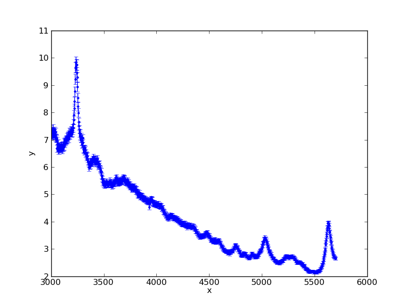
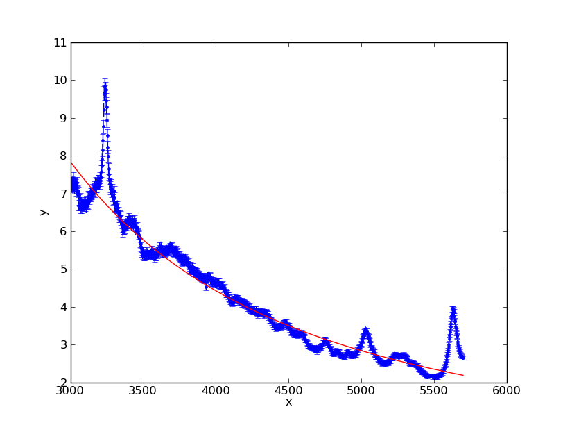
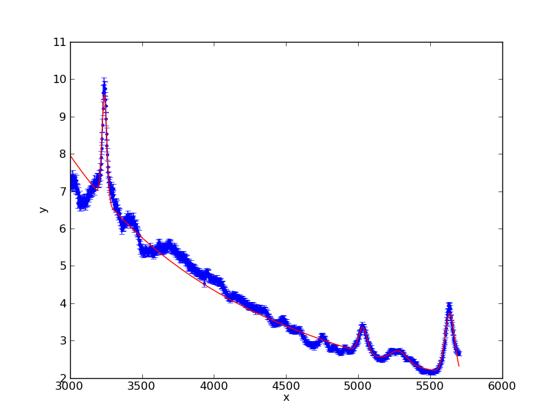
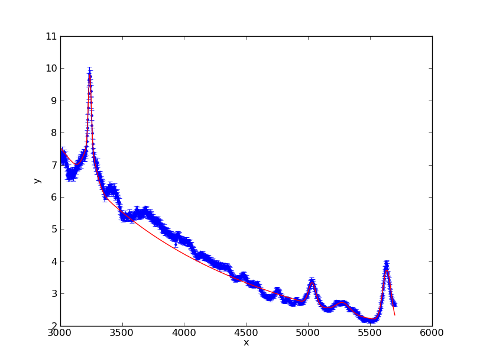
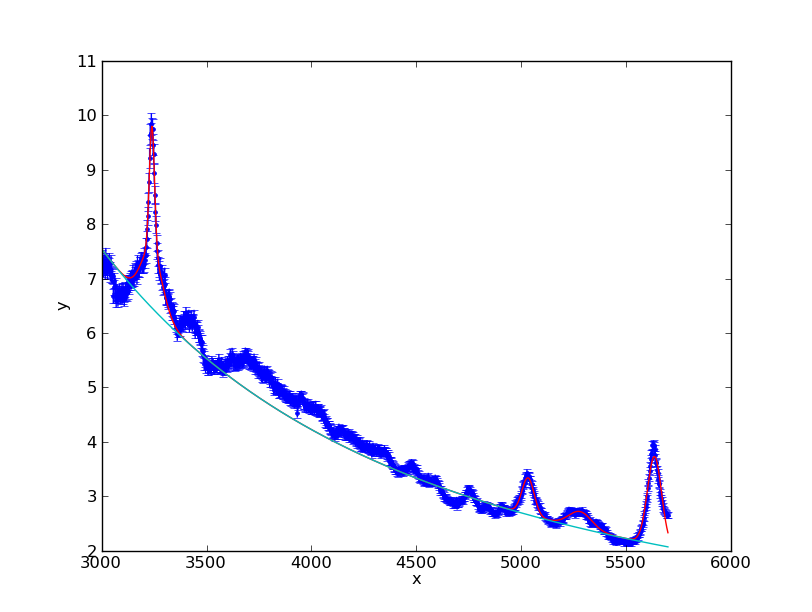

1-D Fitting in Sherpa
---------------------

Enough of the low-level API.  Sherpa includes a set of high-level procedural
functions that manipulate the API-level objects underneath.

We will start over with our 3C 273 spectrum using the Sherpa high-level UI::

  $ ipython -pylab

Begin by importing ``pyfits`` and then import the Sherpa UI module into a
namespace named ``ui``::

  import pyfits
  import sherpa.ui as ui

Read in the columns from the FITS file and load the arrays into a Sherpa data
set::

  dat = pyfits.open('3c273.fits')[1].data
  ui.load_arrays(1, dat.field('WAVELENGTH'), dat.field('FLUX')*1e14, dat.field('FLUX') * 0.02e14)

Filter the spectral coordinates from 3000 to 5700 Angstroms and plot the
spectrum using Sherpa's high level plotting interface to matplotlib::

  ui.notice(3000, 5700)
  ui.plot_data()

Define a power-law to start.  Notice the compact syntax for efficiently defining
model instances inline.  ``powlaw1d`` acts as a factory function that will
create new power-law model instance by simply accessing an attribute using a
choosen model identifier.  ``pow1`` is now a power-law model accessible in
scope::

  ui.set_model(ui.powlaw1d.pow1)
  pow1.ref = 4000.      # Set power-law reference to 4000 Angstroms
  print ui.get_model()  # or ui.show_model() for interactive use

Fit the filtered continuum using ``pow1`` and plot the fitted model atop the
data.  The default fit statistic is chi-squared with Gehrels variance and the
default optimization method is least squares (Levenberg-Marquardt)::

  ui.fit()
  ui.plot_fit()

Quickly access Sherpa fit information using ``get_fit_results``::

  results = ui.get_fit_results()
  print results

Display fit session information using ``show_all``.  This will open the `less`
program to display the fit information.  Quit `less` by pressing `q`::

  ui.show_all()

OK.  Time to fit the spectral lines.  We will build on the power-law model by
adding four Gaussian models in an arithmetic expression.  Notice how the model
definition instaniates and returns each instance.  Each instance also supports
the special ``__add__`` operator to combine the expression into a composite
model that is finally passed as a single argument to ``set_model``::

  # Add four Gaussian models, using cursor interactively to get
  # decent starting wavelength values
  ui.set_model(pow1 + ui.gauss1d.g1 + ui.gauss1d.g2 + ui.gauss1d.g3 + ui.gauss1d.g4)
  g1.pos = 3250
  g2.pos = 5000
  g3.pos = 5260
  g4.pos = 5600
  g1.fwhm = 50
  g2.fwhm = 50
  g3.fwhm = 50
  g4.fwhm = 50
  print ui.get_model()  # or ui.show_model() for interactive use

Now fit with the four Gaussian lines plus the continuum and plot the results
with the spectrum::

  # Fit and plot
  ui.fit()
  ui.plot_fit()
  print ui.get_model()

Next, we will add a broad line component to the first line.  Notice that the model
components previously defined are referenced using the identifier.  Also, we will
link the Gaussian positions together and define the broad line FWHM to be four
times the FHWM of the narrow line::

  ui.set_model(pow1 + g1 + g2 + g3 + g4 + ui.gauss1d.g1_broad)
  g1_broad.pos = g1.pos         # Force broad line to same wavelength as narrow
  g1_broad.fwhm = g1.fwhm * 4   # Link with algebraic expression

The link expressions for the position and FWHM can be seen in the model display
information::

  print ui.get_model() # or ui.show_model() for interactive use

Freeze the Gaussian lines at the red end of the spectrum at their current
best-fit parameter values::

  ui.freeze(g2, g3, g4)

Add an additional filter to ignore the Fe complex and other lines during
fitting::

  ui.ignore(3360, 4100)

Fit, then notice the full wavelength range to plot the fit::

  ui.fit()
  ui.notice(3000, 5700)
  ui.plot_fit()

Finally, overlay the power-law component atop the fit plot::

  ui.plot_model_component(pow1, overplot=True)

