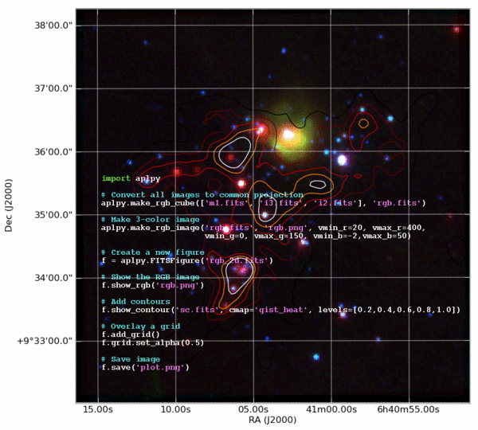

..    # :tocdepth: 2

Practical Python for Astronomers
==================================

.. Make aplpy.gif with:
   convert -delay 700 aplpy.png -delay 300 aplpy_plain.png -loop 0 aplpy.gif

.. toctree::
   :glob:
   :maxdepth: 2
   :hidden:

   overview
   why-python
   quick-tour
   who-python
   wrapup
   comparison
   python-requirements
