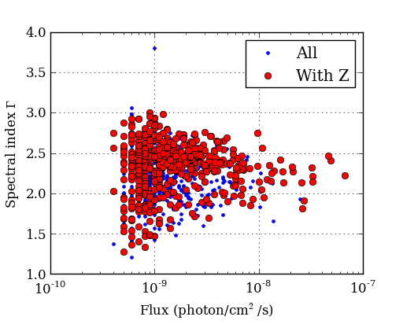
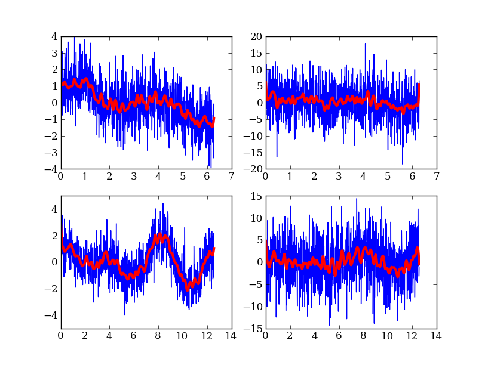

.. include:: ../references.rst

Quick tour of Python
====================

.. Basic:
     read file
     plot histogram
     plot cumulative distribution
     write file
   Numpy / Scipy docs main page: http://docs.scipy.org/doc/
   Modeling / analysis
   Built in numpy funcs (stats, sort)
   SciPy overview http://docs.scipy.org/doc/scipy-0.9.0/reference/
   Curve fit example
   Synthetic images
   Compiled extensions
   HDF5 (Read 100 million data rows, beyond capability of TOPCAT) (live demo)
   Esaview (live demo)
   CygOb2 aeview.py
   C-COSMOS browse (live demo)
   
In the spirit of this workshop let's jump in to real Python analysis code.
These examples assume you are using `pylab
<http://matplotlib.sourceforge.net/faq/usage_faq.html#matplotlib-pylab-and-pyplot-how-are-they-related>`_
(you'll understand what that is after the 2nd hands-on session).

Reading a table and plotting
----------------------------

The Fermi Gamma-ray satellite has a nice catalog of AGN available through
HEASARC.  The script below will read in the catalog data using the `asciitable`_
module, do some basic filtering with `NumPy`_, and make a couple of plots with
`matplotlib`_ ::

  import asciitable   # Make external package available

  # Read table.  
  # ==> dat[column_name] and dat[row_number] both valid <==
  dat = asciitable.read('fermi_agn.dat')

  redshift = dat['redshift']    # array of values from 'redshift' column
  flux = dat['photon_flux']
  gamma = dat['spectral_index']

  # Select rows that have a measured redshift
  with_z = (redshift != -999)

  figure(1)
  semilogx(flux, gamma, '.b', label='All')  # First plot!
  semilogx(flux[with_z], gamma[with_z], 'or', label='With Z')
  legend(numpoints=1)
  grid()
  xlabel('Flux (photon/cm$^2$/s)')   # latex works
  ylabel('Spectral index $\Gamma$')

  # Select low- and high-z samples
  lowz = with_z & (redshift < 0.8)
  highz = with_z & (redshift >= 0.8)

  figure(2)
  bins = arange(1.2, 3.0, 0.1)    # values from 1.2 to 3.0 by 0.1
  hist(gamma[lowz], bins, color='b', alpha=0.5, label='z < 0.8')
  hist(gamma[highz], bins, color='r', alpha=0.5, label='z > 0.8')
  xlabel('Spectral index $\Gamma$')
  title('$\Gamma$ for low-z and high-z samples')
  legend(loc='upper left')

  asciitable.write(dat[with_z], 'fermi_agn_with_z.dat')

.. image:: hist.png
   :scale: 70%

Curve fitting with SciPy
------------------------

`SciPy`_ provides `curve_fit
<http://docs.scipy.org/doc/scipy/reference/generated/scipy.optimize.curve_fit.html>`_,
a simple and useful implementation of the Levenburg-Marquardt non-linear
minimization algorithm.  This example shows a code to generate a fake dataset
and then fit with a gaussian, returning the covariance matrix for parameter
uncertainties.

::

  from scipy.optimize import curve_fit

  # Create a function
  # ==> First encounter with *whitespace* in Python <==
  def gaussian(x, a, b, c):
      val = a * exp(-(x - b)**2 / c**2)
      return val

  # Generate fake data.
  # Note: functions in random package, array arithmetic (exp)
  n = 100
  x = random.uniform(-10., 10., n)  
  y = exp(-(x - 3.)**2 / 4) * 10. + random.normal(0., 2., n)
  e = random.uniform(0.1, 1., n)

  # Fit
  popt, pcov = curve_fit(gaussian, x, y, sigma=e)

  # Print results
  print "Scale =  %.3f +/- %.3f" % (popt[0], sqrt(pcov[0, 0]))
  print "Offset = %.3f +/- %.3f" % (popt[1], sqrt(pcov[1, 1]))
  print "Sigma =  %.3f +/- %.3f" % (popt[2], sqrt(pcov[2, 2]))

  # Plot data
  errorbar(x, y, yerr=e, linewidth=1, color='black', fmt=None)

  # Plot model
  xm = linspace(-10., 10., 100)  # 100 evenly spaced points
  plot(xm, gaussian(xm, popt[0], popt[1], popt[2]))

  # Save figure
  savefig('fit.png')
   
The plotted fit result is as shown below:

.. image:: fit.png
   :scale: 50%

Intermission: NumPy, Matplotlib, and SciPy
------------------------------------------

These three packages are the workhorses of scientific Python.  

- `NumPy`_ is the fundamental package for scientific computing in Python [`NumPy Reference
  <http://docs.scipy.org/doc/numpy/reference/>`_]
- `Matplotlib`_ is one of many plotting packages.  Started as a Matlab clone.
- `SciPy`_ is a collection of mathematical algorithms and convenience
  functions [`SciPy Reference <http://docs.scipy.org/doc/scipy/reference/>`_]

Synthetic images
----------------

This example demonstrates how to create a synthetic image of a cluster,
including convolution with a Gaussian filter and the addition of noise.
::

  import pyfits
  from scipy.ndimage import gaussian_filter

  # Create empty image
  nx, ny = 512, 512
  image = zeros((ny, nx))

  # Set number of stars
  n = 10000

  # Generate random positions
  r = random.random(n) * nx
  theta = random.uniform(0., 2. * pi, n)

  # Generate random fluxes
  f = random.random(n) ** 2

  # Compute position
  x = nx / 2 + r * cos(theta)
  y = ny / 2 + r * sin(theta)

  # Add stars to image
  # ==> First for loop and if statement <==
  for i in range(n):
      if x[i] >= 0 and x[i] < nx and y[i] >= 0 and y[i] < ny:
          image[y[i], x[i]] += f[i]

  # Convolve with a gaussian
  image = gaussian_filter(image, 1)

  # Add noise
  image += random.normal(3., 0.01, image.shape)

  # Write out to FITS image
  pyfits.writeto('cluster.fits', image, clobber=True)

The simulated cluster image is below:

.. image:: synthetic_image.png
   :scale: 70%

Running existing compiled codes
-------------------------------

In addition to just doing computations and plotting, Python is great for gluing
together other codes and doing system type tasks.

::

  import os
  import asciitable

  smoothing = 30  # Smoothing window length
  freqs = [2, 4]  # Frequency values for making data
  noises = [1, 5] # Noise amplitude inputs

  figure(1)
  clf()

  # Loop over freq and noise values, running standalone code to create noisy data
  # and smooth it.  Get the data back into Python and plot.
  plot_num = 1
  for freq in freqs:
      for noise in noises:
          # Run the compiled code "make_data" to make data as a list of x, y, y_smooth
          cmd = 'make_data %s %s %s' % (freq, noise, smoothing)
          print 'Running', cmd
          out = os.popen(cmd).read()
          # out now contains the output from <cmd> as a single string

          # Write the output to a file
          filename = 'data_%s_%s' % (freq, noise)
          open(filename, 'w').write(out)

          # Parse the output string as a table
          dat = asciitable.read(out)

          # Make a plot
          subplot(2, 2, plot_num)
          plot(dat['x'], dat['y'])
          plot(dat['x'], dat['y_smooth'], linewidth=3, color='r')

          plot_num += 1

Making a publication quality image
----------------------------------

Making a publication quality image is a snap in Python using the `APLpy
<http://aplpy.github.com>`_ package.  Images can be made interactively or
(reproducibly) with a script.  Let's see how the cover image for today's
talk was made.

::

  import aplpy

  # Convert all images to common projection
  aplpy.make_rgb_cube(['m1.fits', 'i3.fits', 'i2.fits'], 'rgb.fits')

  # Make 3-color image
  aplpy.make_rgb_image('rgb.fits', 'rgb.png', 
                       vmin_r=20, vmax_r=400,
                       vmin_g=0, vmax_g=150, 
                       vmin_b=-2,vmax_b=50)

  # Create a new figure
  fig = aplpy.FITSFigure('rgb_2d.fits')

  # Show the RGB image
  fig.show_rgb('rgb.png')

  # Add contours
  fig.show_contour('sc.fits', cmap='gist_heat', levels=[0.2,0.4,0.6,0.8,1.0])

  # Overlay a grid
  fig.add_grid()
  fig.grid.set_alpha(0.5)

  # Save image
  fig.save('plot.png')

This produces the nice image:

.. image:: image_plotting.png 
   :scale: 60%

And much much more...
----------------------

- Fast access to big (1e9 rows) tables with `PyTables
  <http://www.pytables.org>`_ + `HDF5 <http://www.hdfgroup.org/HDF5/>`_
- 3-d plotting and surface rendering with `Mayavi <http://mayavi.sourceforge.net/>`_
- Sophisticated data modeling with advanced statistics with `Sherpa 
  <http://cxc.harvard.edu/sherpa/>`_
- `Query VO tables
  <http://www.astropython.org/blog/2011/3/Querying-tables-in-the-virtual-observatory>`_
  and `broadcast <https://gist.github.com/855678>`_ or 
  `retrieve <https://gist.github.com/855678>`_ tables to VO applications like 
  `TOPCAT`_.  
- GUI application to quickly view thousands of X-ray survey image cutouts
- Python-based web site for browsing a complex multi-wavelength survey
- `Thermal modeling of the Chandra X-ray satellite 
  <http://conference.scipy.org/scipy2010/slides/tom_aldcroft_chandra.pdf>`_
- Interactive multi-user plots accessed through a web browser (!)
- Distributed computing with `MPI for Python <http://mpi4py.scipy.org/>`_
- Make a little `video distribution web site <http://youtube.com>`_
