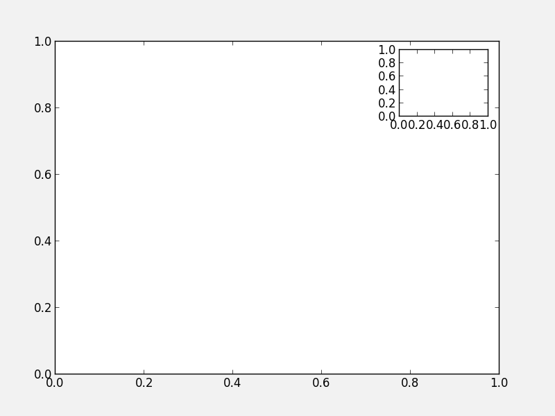
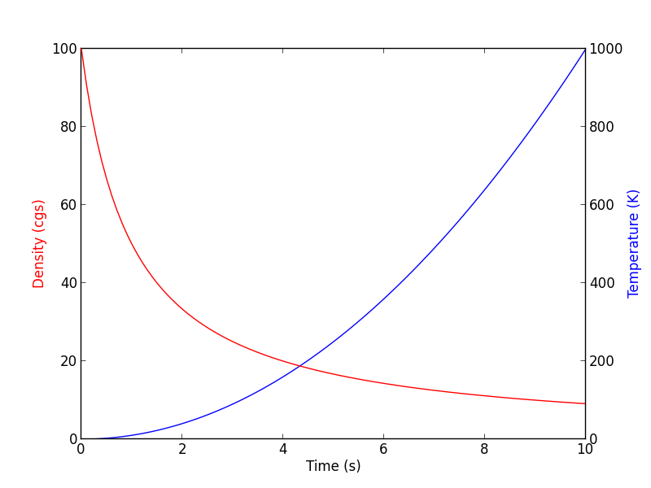
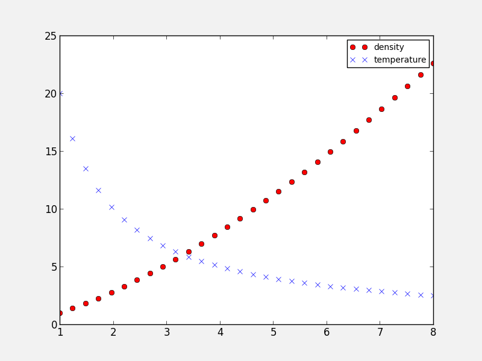
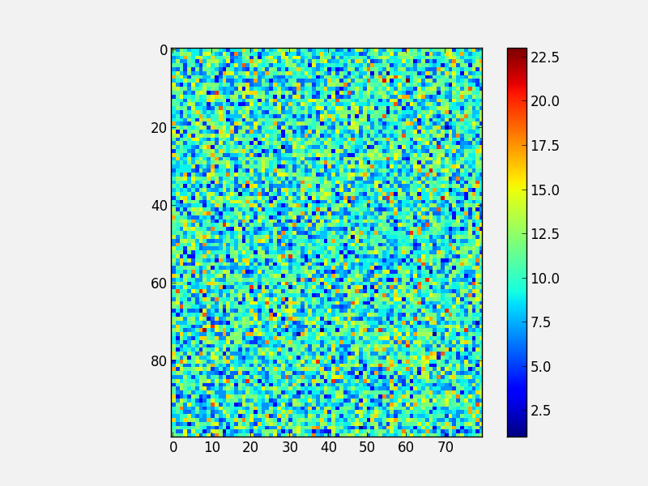
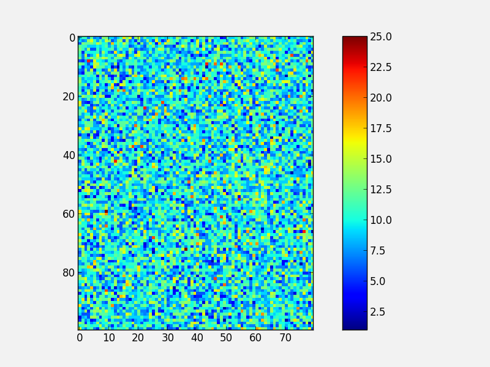
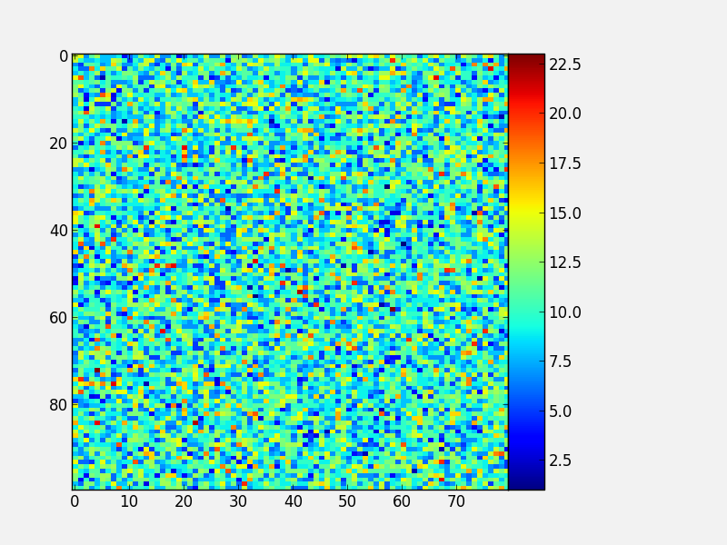
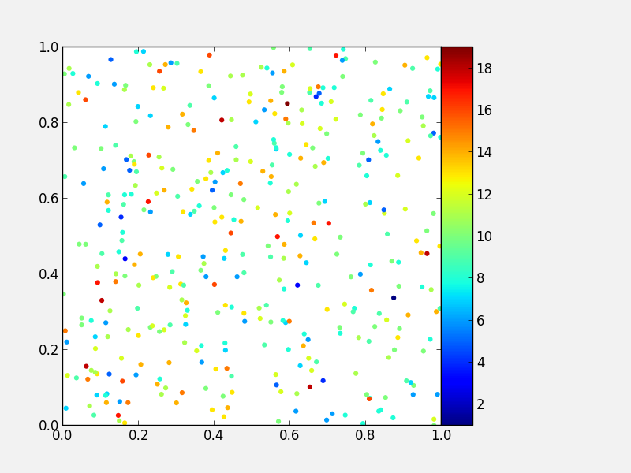
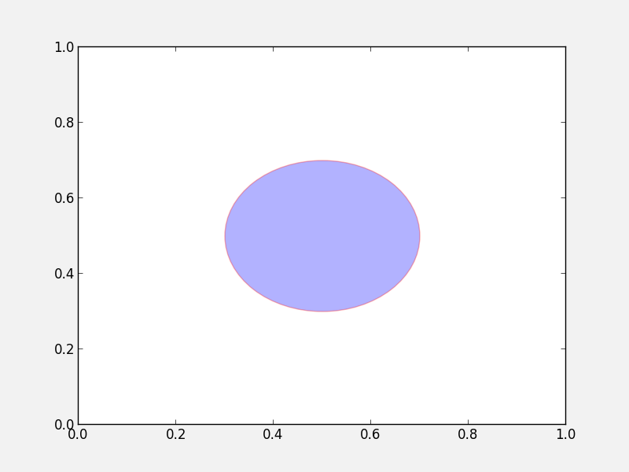
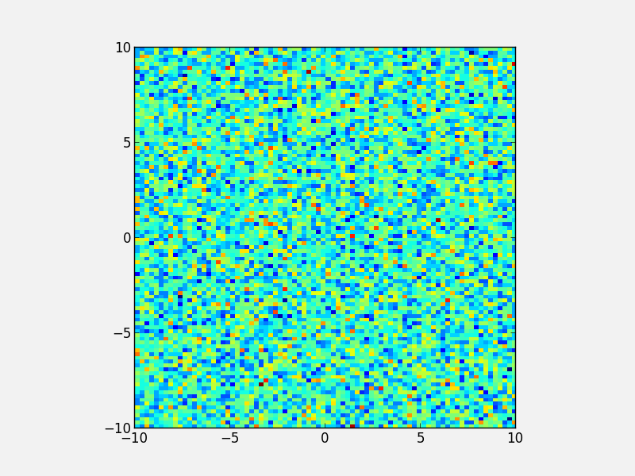

Advanced plotting
=================

.. _`subplots_adjust`: http://matplotlib.sourceforge.net/api/pyplot_api.html#matplotlib.pyplot.subplots_adjust
.. _`rc`: http://matplotlib.sourceforge.net/api/pyplot_api.html#matplotlib.pyplot.rc
.. _`matplotlibrc`: http://matplotlib.sourceforge.net/users/customizing.html#a-sample-matplotlibrc-file
.. _`gridspec`: http://matplotlib.sourceforge.net/users/gridspec.html
.. _`add_axes`: http://matplotlib.sourceforge.net/api/figure_api.html?highlight=add_axes#matplotlib.figure.Figure.add_axes
.. _`add_subplot`: http://matplotlib.sourceforge.net/api/figure_api.html?highlight=add_axes#matplotlib.figure.Figure.add_subplot

Moving to object-based plotting
-------------------------------

In :doc:`matplotlib`, we learned about making plots using a procedural method, e.g.::

    plt.figure()
    plt.subplot(1, 1, 1)
    plt.plot([1, 2, 3, 4])
    plt.ylabel('some numbers')

To allow more customization, we need to move to a more object-based way to
make the plots. This method involves storing various elements of the of the
plots in variables (these are *objects* in object-oriented terminology). The
above example becomes::

    fig = plt.figure()  # create a figure object
    ax = fig.add_subplot(1, 1, 1)  # create an axes object in the figure
    ax.plot([1, 2, 3, 4])
    ax.set_ylabel('some numbers')

This method is more convenient for advanced plots, and we will be adopting
this for the current workshop. One of the biggest advantages of using this method is that it allows users to easily handle multiple figures/axes without getting confused as to which one is currently active. For example::

    fig1 = plt.figure()
    fig2 = plt.figure()
    ax1 = fig1.add_subplot(1, 1, 1)
    ax2 = fig2.add_subplot(2, 1, 1)
    ax3 = fig2.add_subplot(2, 1, 2)

defines two figures, one with two sets of axes, and one with one set of axes. Subsequently, use ``ax1.plot(...)`` to plot to the subplot in ``fig1``, and ``ax2.plot(...)`` and ``ax3.plot(...)`` to plot in the top and bottom subplots of ``fig2`` respectively.

The slight downside of this method is that in interactive mode, you will need to explicitly call::

    fig.canvas.draw()

to refresh the figure after plotting commands (where ``fig`` is the figure object).

.. note:: while this method is more object-oriented than the procedural method
          we presented last time, it still relies on pyplot to instantiate the
          figure::

              fig = plt.figure()

          It is actually possible to use a pure object-oriented interface to
          matplotlib, but we will not cover this here.

Figure size
-----------

The first thing to consider when making a publication-quality plot is what the final desired size of the plot will be. The figure size can be specified via::

    fig = plt.figure(figsize=(6,8))

where the ``figsize`` argument takes a tuple of two values, the width and height of the figure in inches. Setting the figure size right from the start is important in order to ensure that the figure does not need to be shrunk or enlarged in a publication, ensuring that the font sizes will look right.

Placing Axes
------------

The easiest way to make a set of axes in a matplotlib figure is to use the subplot command::

    fig = plt.figure()  # create a figure object
    ax = fig.add_subplot(1, 1, 1)  # create an axes object in the figure

.. image:: advanced_plots/subplot.png
   :scale: 60%
   :align: center

The second line creates subplot on a 1x1 grid. As we described before, the arguments for ``add_subplot`` are the number of rows, columns, and the ID of the subplot, between 1 and the number of columns times the number of rows.

While it is possible to adjust the spacing between the subplots using `subplots_adjust`_, or use the `gridspec`_ functionality for more advanced subplotting, it is often easier to just use the more general `add_axes`_ method instead of `add_subplot`_. The `add_axes`_ method takes a list of four values, which are ``xmin``, ``ymin``, ``dx``, and ``dy`` for the subplot, where ``xmin`` and ``ymin`` are the coordinates of the lower left corner of the subplot, and ``dx`` and ``dy`` are the width and height of the subplot, with all values specified in relative units (where 0 is left/bottom and 1 is top/right). For example::

    fig = plt.figure()
    ax = fig.add_axes([0., 0., 1., 1., ])

will show a subplot that occupies all the figure (and the axis labels will in fact be hidden). This allows us to easily set up axes that touch::

    fig = plt.figure()
    ax1 = fig.add_axes([0.1, 0.1, 0.4, 0.8])
    ax2 = fig.add_axes([0.5, 0.1, 0.4, 0.8])

.. image:: advanced_plots/two_axes.png
   :scale: 60%
   :align: center

although we still need a good way to hide the axis labels in the subplot on the right hand side. Combined with the ``figsize=`` argument, this allows us to control the exact aspect ratio of the subplots.

Note that is also allows us to easily make inset plots::

    fig = plt.figure()
    ax1 = fig.add_axes([0.1, 0.1, 0.8, 0.8])
    ax2 = fig.add_axes([0.72, 0.72, 0.16, 0.16])

.. admonition:: Exercise: Practice creating custom axes

    Create a set of square axes in a figure that has ``figsize=(10, 5)``,
    leaving enough space for the axis and tick labels. Make the set of axes
    centered in the figure.

.. raw:: html

   
Click to Show/Hide Solution
 

The figure has an aspect ratio of 2:1, so we need to compensate for this in the axes dimensions, since these are in relative units::

    fig = plt.figure(figsize=(10, 5))
    ax = fig.add_axes([0.3, 0.1, 0.4, 0.8])

.. image:: advanced_plots/exercise_1.png
   :scale: 60%
   :align: center

.. raw:: html

   

Twin axes
---------

In some cases, it can be desirable to show two different x axes (e.g. distance and redshift), or two different y axes (e.g. two different quantities such as density and temperature). Matplotlib provides an easy way to create *twin* axes. For example::

    fig = plt.figure()
    ax1 = fig.add_subplot(1, 1, 1)
    ax2 = ax.twinx()

creates a new set of axes (``ax2``) that shares the x-axis with ``ax1``, but can have a separate y-axis (similarly, ``twiny`` would return a second set of axes sharing the y-axis, but with a separate x-axis). As an example, we can use this to plot two different quantities as a function of time::

    fig = plt.figure()
    ax1 = fig.add_subplot(1, 1, 1)
    ax2 = ax1.twinx()
    t = np.linspace(0., 10., 100)
    ax1.plot(t, t ** 2, 'b-')
    ax2.plot(t, 1000 / (t + 1), 'r-')
    ax1.set_ylabel('Density (cgs)', color='red')
    ax2.set_ylabel('Temperature (K)', color='blue')
    ax1.set_xlabel('Time (s)')

Controlling the appearance of plots
-----------------------------------

In Matplotlib, every plot element is a full Python object with properties that can be edited. Therefore, this means that properties can always be specified by setting the appropriate arguments in methods, or by retrieving these objects. For example::

    # Initialize the figure and subplot
    fig = plt.figure()
    ax = fig.add_subplot(1, 1, 1)

    # Set the font size via a keyword argument
    ax.set_title("My plot", fontsize='large')

    # Retrieve an element of a plot and set properties
    for tick in ax.xaxis.get_ticklabels():
        tick.set_fontsize('large')
        tick.set_fontname('Times New Roman')
        tick.set_color('blue')
        tick.set_weight('bold')

.. image:: advanced_plots/appearance_fonts_custom.png
   :scale: 60%
   :align: center

This is very powerful, as it allows you to customize virtually *all* elements in a plot. In general, most matplotlib functions/methods return a *handle* to the element that is being plotted. In the following example::

    fig = plt.figure()
    ax = fig.add_subplot(1, 1, 1)
    title = ax.set_title("My plot", fontsize='large')
    points = ax.scatter([1,2,3], [4,5,6])

``title`` will be the title object, and points will be a scatter object. Both can be used to set/change the current properties.

.. admonition:: Exercise: Explore customization

    Run the above example in ``ipython --pylab``, and try and use the title
    and points objects to change the points to be red, and the title to have
    an ``x-large`` font size.

    **Hint 1:** <tab> suggestion/completion is your friend!

    **Hint 2:** Don't forget to run ``fig.canvas.draw()`` to refresh the plot
    after modifying properties!

.. raw:: html

   
Click to Show/Hide Solution
 

::

   points.set_color('red')
   title.set_fontsize('x-large')
   fig.canvas.draw()

Easy! :-)

.. raw:: html

   

**Remember:** Tab completion is your friend for exploring all the capabilities
of Matplotlib. When you plot something, you can always get a handle to it, and
then use this to get and set parameters!

``rc`` parameters
-----------------

In practice, this can be a lot of work for simple and common things (e.g.
setting the tick label properties), so matplotlib allows users to specify
default properties via rc parameters. These can be set either in a
``~/.matplotlib/matplotlibrc`` file, or in a script. To set these via a file,
see `matplotlibrc`_ (this also shows all the options that are availables).
Example (modified) lines from this script include::

    #xtick.major.size     : 4      # major tick size in points
    #xtick.minor.size     : 2      # minor tick size in points
    #xtick.major.pad      : 4      # distance to major tick label in points
    #xtick.minor.pad      : 4      # distance to the minor tick label in points
    #xtick.color          : r      # color of the tick labels
    #xtick.labelsize      : medium # fontsize of the tick labels
    #xtick.direction      : out     # direction: in or out

These lines are commented out by default, but you can uncomment them to make them active. However, it's often easier to define properties on a per-script basis using the `rc`_ function. This function's first argument is the category of the settings, and this is followed by a set of keyword arguments to set the parameters for this element. To reproduce the above lines from the ``matplotlibrc`` file, one would do::

    plt.rc('xtick', color='r', labelsize='medium', direction='out')
    plt.rc('xtick.major', size=4, pad=4)
    plt.rc('xtick.minor', size=2, pad=4)

after which running::

    fig = plt.figure()
    ax = fig.add_subplot(1, 1, 1)

produces:

.. image:: advanced_plots/appearance_fonts_rc.png
   :scale: 60%
   :align: center

It is not necessary to specify all the parameters in every script - only specify the ones you want to change from the default, e.g.::

    plt.rc('xtick', color='red')

If you need to reset the parameters to their default values, use::

    plt.rcdefaults()

Adding a legend
---------------

Adding a legend to a plot is straightforward. First, whenever calling a plotting routine for which you want the results included in the legend, add the ``label=`` argument::

    fig = plt.figure()
    ax = fig.add_subplot(1, 1, 1)
    x = np.linspace(1., 8., 30)
    ax.plot(x, x ** 1.5, 'ro', label='density')
    ax.plot(x, 20/x, 'bx', label='temperature')

Then, call the ``legend`` method::

    ax.legend()

and the legend will automatically appear!

.. image:: advanced_plots/legend.png
   :scale: 60%
   :align: center

Note that you can control the font size (and other properties) in a legend with the following rc parameter::

    plt.rc('legend', fontsize='small')

which would produce:

Adding a colorbar
-----------------

Adding a colorbar to a plot is also straightforward, and involves capturing the handle to the ``imshow`` object::

    fig = plt.figure()
    ax = fig.add_subplot(1, 1, 1)
    image = np.random.poisson(10., (100, 80))
    i = ax.imshow(image, interpolation='nearest')
    fig.colorbar(i)  # note that colorbar is a method of the figure, not the axes

Note that in the above ``colorbar`` call, the colorbar box automatically eats up space from the axes to which it is attached. If you want to customize exactly where the colorbar appears, you can define a set of axes, and pass it to colorbar via the ``cax=`` argument::

    fig = plt.figure()
    ax = fig.add_axes([0.1,0.1,0.6,0.8])
    image = np.random.poisson(10., (100, 80))
    i = ax.imshow(image, interpolation='nearest')
    colorbar_ax = fig.add_axes([0.7, 0.1, 0.05, 0.8])
    fig.colorbar(i, cax=colorbar_ax)

You will notice that even though the axes we specified *should* line up nicely, they don't. This is because imshow automatically modifies the axes so that pixels are square. We can fix this with ``aspect='auto'``::

    fig = plt.figure()
    ax = fig.add_axes([0.1,0.1,0.6,0.8])
    image = np.random.poisson(10., (100, 80))
    i = ax.imshow(image, aspect='auto', interpolation='nearest')
    colorbar_ax = fig.add_axes([0.7, 0.1, 0.05, 0.8])
    fig.colorbar(i, cax=colorbar_ax)

With these options, you should now have complete control on the placement of axes and colorbars!

Note that it is also possible to use colorbars with other types of plots, for example scatter plots::

    fig = plt.figure()
    ax = fig.add_axes([0.1, 0.1, 0.6, 0.8])
    x = np.random.random(400)
    y = np.random.random(400)
    c = np.random.poisson(10., 400)
    s = ax.scatter(x, y, c=c, edgecolor='none')
    ax.set_xlim(0., 1.)
    ax.set_ylim(0., 1.)
    colorbar_ax = fig.add_axes([0.7, 0.1, 0.05, 0.8])
    fig.colorbar(s, cax=colorbar_ax)

Custom ticks and labels
-----------------------

In some cases, you may want to specify which tick locations should be shown. This can be done with::

    fig = plt.figure()
    ax = fig.add_subplot(1, 1, 1)
    ax.set_xticks([0.1, 0.5, 0.7])
    ax.set_yticks([0.2, 0.4, 0.8])

.. image:: advanced_plots/custom_ticks_1.png
   :scale: 60%
   :align: center

It is also easy to specify what the label strings should be explicitly::

    fig = plt.figure()
    ax = fig.add_subplot(1, 1, 1)
    ax.set_xticks([0.1, 0.5, 0.7])
    ax.set_xticklabels(['a', 'b', 'c'])
    ax.set_yticks([0.2, 0.4, 0.8])
    ax.set_yticklabels(['first', 'second', 'third'])

.. image:: advanced_plots/custom_ticks_2.png
   :scale: 60%
   :align: center

It is best to only use ``set_ticklabels`` when also using ``set_ticks``, so that you know exactly which ticks you are assigning the labels for. The above can be used for example if you would like to make a plot as a function of spectral type, or if you want to format the labels in a very specific way.

This can also be used to hide ticks and/or labels. For example, to hide ticks and labels on the x axis, just do::

    fig = plt.figure()
    ax = fig.add_subplot(1, 1, 1)
    ax.set_xticks([])

.. image:: advanced_plots/custom_ticks_3.png
   :scale: 60%
   :align: center

If you only want to hide labels, not the ticks, from an axis, then just do::

    fig = plt.figure()
    ax = fig.add_subplot(1, 1, 1)
    ax.set_xticklabels('')

.. image:: advanced_plots/custom_ticks_4.png
   :scale: 60%
   :align: center

.. admonition:: Exercise: Practice setting custom labels

    Make a plot that looks like this (note the x-axis):

    .. image:: advanced_plots/exercise_3.png
       :scale: 60%
       :align: center

    (the y values are ``[4, 3, 2, 3, 4, 5, 4]``)

.. raw:: html

   
Click to Show/Hide Solution
 

::

    # Initialize figure and axes
    fig = plt.figure(figsize=(8, 6))
    ax = fig.add_axes([0.1, 0.1, 0.8, 0.8])

    # Define spectral types
    spectral_id = [1, 2, 3, 4, 5, 6, 7]
    spectral_types = ['O', 'B', 'A', 'F', 'G', 'K', 'M']

    # Plot the data
    ax.plot(spectral_id, [4, 3, 2, 3, 4, 5, 4], 'ro')

    # Set the limits
    ax.set_xlim(0.5, 7.5)
    ax.set_ylim(0., 10.)

    # Set the custom ticks on the x-axis
    ax.set_xticks(spectral_id)
    ax.set_xticklabels(spectral_types)

    # Set the axis labels
    ax.set_xlabel("Spectral type")
    ax.set_ylabel("Number of sources")

.. raw:: html

   

.. admonition:: Exercise: Practice axes placement and hiding labels

    Create a set of 4 axes in a 2 by 2 grid, with no space between the sets of
    axes, and with no labels in the overlap regions, like this:

    .. image:: advanced_plots/exercise_4.png
        :scale: 60%
        :align: center

.. raw:: html

   
Click to Show/Hide Solution
 

::

    fig = plt.figure(figsize=(8, 8))
    ax1 = fig.add_axes([0.1, 0.1, 0.4, 0.4])
    ax1.set_xticks([0., 0.2, 0.4, 0.6, 0.8])
    ax1.set_yticks([0., 0.2, 0.4, 0.6, 0.8])
    ax2 = fig.add_axes([0.1, 0.5, 0.4, 0.4])
    ax2.set_xticklabels('')
    ax3 = fig.add_axes([0.5, 0.1, 0.4, 0.4])
    ax3.set_yticklabels('')
    ax4 = fig.add_axes([0.5, 0.5, 0.4, 0.4])
    ax4.set_xticklabels('')
    ax4.set_yticklabels('')

.. raw:: html

   

Artists, Patches, and Lines
---------------------------

Virtually all objects in Matplotlib are *artists*, which are objects that have
visual attributes that can be set. There are two important kinds of artists:
*lines*, and *patches*.

It is actually very easy to add your own custom lines or patches (e.g. a
circle, a square, etc.) to a plot. In the case of a patch, import the patch
class you need::

    from matplotlib.patches import Circle

Then, create an instance of the patch::

    c = Circle((0.5, 0.5), radius=0.2,
                edgecolor='red', facecolor='blue', alpha=0.3)

Finally, add your patch to your figure::

    ax.add_patch(c)

See `here <http://matplotlib.sourceforge.net/api/artist_api.html?#module-matplotlib.patches>`_ for a complete list of patches and options.

Similarly, there are line classes::

    from matplotlib.lines import Line2D
    ...
    l = Line2D(...)
    ax.add_line(l)

See `here <http://matplotlib.sourceforge.net/api/artist_api.html?#module-matplotlib.lines>`_ for a complete list of line types and options.

Tips and tricks
---------------

Matplotlib gallery
^^^^^^^^^^^^^^^^^^

We've only touched the tip of the iceberg in terms of methods for plotting, so remember that the `Matplotlib gallery <http://matplotlib.sourceforge.net/gallery.html>`_ is your friend! Just click on a figure to see the code that produced it!

Designing plots
^^^^^^^^^^^^^^^

When designing plots, it's often fastest to save the plot to PNG when trying out different commands, and to switch to EPS and/or PDF (if necessary) only at the very end, once the plot is satisfactory, because PNG output is fastest. In particular, on MacOS X, if you have the PNG file open, and re-run the script to re-generate it, you simply need to click on the open file to refresh, which makes it easy to tweak the plot.

Automatic bounding box
^^^^^^^^^^^^^^^^^^^^^^

When saving a plot, the default edge of the output image are set by the edge of the figure. However, in some cases, one might end up with too much whitespace around the axes, or labels that fall partly outside the figure. One way to fix this is to use::

    fig.savefig('myplot.eps', bbox_inches='tight')

Note however that this means that if a figure size was specified when initializing the figure, the final figure size may be a little different.

Showing images/maps with non-pixel coordinates
^^^^^^^^^^^^^^^^^^^^^^^^^^^^^^^^^^^^^^^^^^^^^^

By default, when using ``imshow``, the x- and y-axis show the pixel coordinates. You can change this by specifying the extent of the image in whatever coordinate system you want to use::

    fig = plt.figure()
    ax = fig.add_subplot(1, 1, 1)
    image = np.random.poisson(10., (100, 80))
    i = ax.imshow(image, interpolation='nearest',
                  extent=[-10., 10., -10., 10.])
    fig.savefig('imshow_extent.png', facecolor='0.95')

Note that if you want to use WCS coordinates, you probably want to use :doc:`aplpy` instead!

Separating computations and plotting
^^^^^^^^^^^^^^^^^^^^^^^^^^^^^^^^^^^^

If you are doing calculations prior to plotting, and these take a while to get carried out, it is a good idea to separate the computational part of scripts from the plotting part (i.e. have a dedicated plotting script). You can use files to save the information from the computation routine, and then read this in to a plotting program. The advantage of doing this is that it is easier to tweak the plotting script without re-running the computation every time.

Making many plots
^^^^^^^^^^^^^^^^^

When using the partial object-oriented interface described in this workshop, one needs to be aware that pyplot always keeps a reference to open figures. For example, when doing::

    fig = plt.figure()
    ax = fig.add_subplot(1, 1, 1)

    fig = plt.figure()
    ax = fig.add_subplot(1, 1, 1)

one would normally expect (in Python terms) that when the second figure is created, there are no longer references to the original figure, and the memory should be freed, but this is not the case. Pyplot keeps an internal reference to all figures unless specifically instructed to close a figure. Therefore, when making many plots, users may run out of memory. The solution is to explicitly close figures when they are no longer used::

    fig = plt.figure()
    ax = fig.add_subplot(1, 1, 1)
    plt.close(fig)

    fig = plt.figure()
    ax = fig.add_subplot(1, 1, 1)
    plt.close(fig)