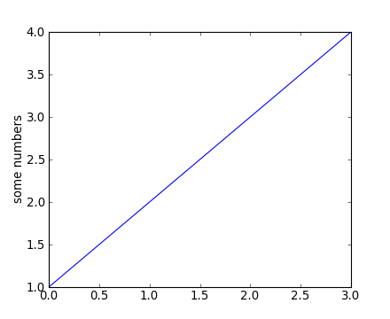
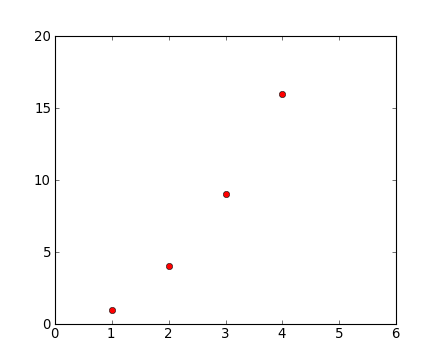
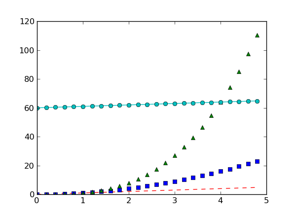
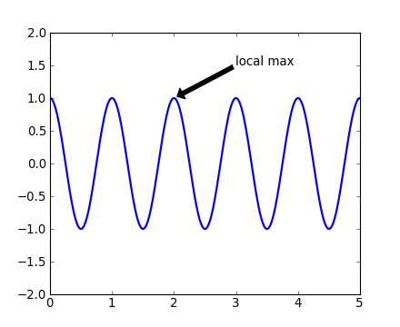

.. include:: ../references.rst

.. NOTES on content for this workshop

   Python concepts
   ----------------
   - scripts / execfile
   - function definition and calling (args, kwargs)
   - Object digression
   - Python types int float str dict tuple list

   Overall: 1d, 2d, 3d plotting with MPL, and intro to APLpy
   Science thread: ???

   1-d
   ---
   - Basic examples: line, scatter, hist
   - Concepts: fig axes, axis ticks (Artist tutorial http://matplotlib.sourceforge.net/users/artists.html)
   - Customization: font size and family, figure size, tick properties
     log / semilog, marker props, line props
   - legend(()
   - Multiple subplots, subplots_adjust, GridSpec
   - Tour of the MPL gallery
   - Object oriented MPL
   - Alpha opacity for markers and areas
   - Hist(): illustrate function definition w/ custom hist (with lines not bars)

   - Also bar charts ala http://matplotlib.sourceforge.net/users/screenshots.html#bar-charts
     (make bar charts like topcat)

   - GUI image viewer similar to ImgView but with pylab (no classes).  Use to
     illustrate scripts and functions.  (Worth it??)
   - MPL docs (tutorial pages) explaing key concepts

   - Useful bits that might not be obvious
     - Freezing axes autoscale(True/False, axis=x|y|both),
     - hold(True/False),
     - interactive on/off (ioff(), plot()..., draw())
     - axis('equal')  axis('scaled'), xlim, ylim
     - Remove ticks and labels (xticks([], []))
     - locs, labels = xticks(); xticks(locs, [])

   - gca() and gcf(), discussion of stateful plotting
   - savefig (backends)

   2-d
   ---
   - imshow()
   - cmap
   - clims

   3-d
   ----
   - mplot3d

.. _`rc()`: http://matplotlib.sourceforge.net/api/pyplot_api.html#matplotlib.pyplot.rc
.. _`plot()`: http://matplotlib.sourceforge.net/api/pyplot_api.html#matplotlib.pyplot.plot
.. _`subplots_adjust()`: http://matplotlib.sourceforge.net/api/pyplot_api.html#matplotlib.pyplot.subplots_adjust
.. _`hist()`: http://matplotlib.sourceforge.net/api/pyplot_api.html#matplotlib.pyplot.hist
.. _`axis()`: http://matplotlib.sourceforge.net/api/pyplot_api.html#matplotlib.pyplot.axis
.. _`cla()`: http://matplotlib.sourceforge.net/api/pyplot_api.html#matplotlib.pyplot.cla
.. _`clf()`: http://matplotlib.sourceforge.net/api/pyplot_api.html#matplotlib.pyplot.clf
.. _`title()`: http://matplotlib.sourceforge.net/api/pyplot_api.html#matplotlib.pyplot.title
.. _`gca()`: http://matplotlib.sourceforge.net/api/pyplot_api.html#matplotlib.pyplot.gca
.. _`gcf()`: http://matplotlib.sourceforge.net/api/pyplot_api.html#matplotlib.pyplot.gcf
.. _`subplot()`: http://matplotlib.sourceforge.net/api/pyplot_api.html#matplotlib.pyplot.subplot
.. _`axes()`: http://matplotlib.sourceforge.net/api/pyplot_api.html#matplotlib.pyplot.axes
.. _`xlabel()`: http://matplotlib.sourceforge.net/api/pyplot_api.html#matplotlib.pyplot.xlabel
.. _`ylabel()`: http://matplotlib.sourceforge.net/api/pyplot_api.html#matplotlib.pyplot.ylabel
.. _`text()`: http://matplotlib.sourceforge.net/api/pyplot_api.html#matplotlib.pyplot.text
.. _`setp()`: http://matplotlib.sourceforge.net/api/pyplot_api.html#matplotlib.pyplot.setp
.. _`close()`: http://matplotlib.sourceforge.net/api/pyplot_api.html#matplotlib.pyplot.close
.. _`figure()`: http://matplotlib.sourceforge.net/api/pyplot_api.html#matplotlib.pyplot.figure
.. _`annotate()`: http://matplotlib.sourceforge.net/api/pyplot_api.html#matplotlib.pyplot.annotate
.. _`matplotlib.pyplot`: http://matplotlib.sourceforge.net/api/pyplot_api.html#matplotlib-pyplot
.. _`marker`: http://matplotlib.sourceforge.net/api/artist_api.html#matplotlib.lines.Line2D.set_marker
.. _`Line2D`: http://matplotlib.sourceforge.net/api/artist_api.html#matplotlib.lines.Line2D
.. _`autoscale()`: http://matplotlib.sourceforge.net/api/pyplot_api.html?highlight=plot.autoscale#matplotlib.pyplot.autoscale
.. _`hold()`: http://matplotlib.sourceforge.net/api/pyplot_api.html?highlight=plot.hold#matplotlib.pyplot.hold
.. _`ioff()`: http://matplotlib.sourceforge.net/api/pyplot_api.html?highlight=plot.ioff#matplotlib.pyplot.ioff
.. _`ion()`: http://matplotlib.sourceforge.net/api/pyplot_api.html?highlight=plot.ion#matplotlib.pyplot.ion
.. _`xlim()`: http://matplotlib.sourceforge.net/api/pyplot_api.html?highlight=plot.xlim#matplotlib.pyplot.xlim
.. _`ylim()`: http://matplotlib.sourceforge.net/api/pyplot_api.html?highlight=plot.ylim#matplotlib.pyplot.ylim
.. _`xticks()`: http://matplotlib.sourceforge.net/api/pyplot_api.html?highlight=plot.xticks#matplotlib.pyplot.xticks
.. _`yticks()`: http://matplotlib.sourceforge.net/api/pyplot_api.html?highlight=plot.yticks#matplotlib.pyplot.yticks

Matplotlib
============

`Matplotlib`_ is a python 2-d plotting library which produces publication quality
figures in a variety of formats and interactive environments across
platforms.  Matplotlib can be used in Python scripts, the Python and IPython
shell, web application servers, and six graphical user interface toolkits.

Documentation
-----------------

The matplotlib documentation is extensive and covers all the functionality in
detail.  The documentation is littered with hundreds of examples showing a plot and the
exact source code making the plot:

- `Matplotlib home page <http://matplotlib.sourceforge.net/>`_: key pylab plotting commands in a table
- `Pyplot tutorial <http://matplotlib.sourceforge.net/users/pyplot_tutorial.html>`_: intro to 1-D plotting
- `Interactive navigation
  <http://matplotlib.sourceforge.net/users/navigation_toolbar.html>`_: how to use the plot window for zooming etc.
- `Screenshots <http://matplotlib.sourceforge.net/users/screenshots.html>`_: screenshots and code for about 20 key types of matplotlib functionality
- `Thumbnail gallery <http://matplotlib.sourceforge.net/gallery.html>`_: hundreds of thumbnails (find a plot like the one you want to make)
- `Text intro <http://matplotlib.sourceforge.net/users/text_intro.html#text-intro>`_: manipulate text
- `Mathematical expressions
  <http://matplotlib.sourceforge.net/users/mathtext.html#mathtext-tutorial>`_:
  put math in figure text or labels
- `FAQ <http://matplotlib.sourceforge.net/faq/index.html>`_: FAQ, including a useful `Howto <http://matplotlib.sourceforge.net/faq/howto_faq.html>`_ section (e.g. multiple y-axis scales, make plot aspect ratio equal, etc)
- `Search <http://matplotlib.sourceforge.net/search.html>`_: find documentation for specific functions or general concepts
- `Customizing matplotlib
  <http://matplotlib.sourceforge.net/users/customizing.html>`_: making it
  beautiful and well-behaved
- `Line2D`_: knobs to twiddle for customizing a line or points in a plot

Hints on getting from here (an idea) to there (a plot)
^^^^^^^^^^^^^^^^^^^^^^^^^^^^^^^^^^^^^^^^^^^^^^^^^^^^^^^^

- Start with `Screenshots
  <http://matplotlib.sourceforge.net/users/screenshots.html>`_ for the broad
  plotting capabilities
- Googling is unfortunately not the best way to get to the detailed help for
  particular functions.  For example `googling "matplotlib errorbar"
  <http://www.google.com/search?ie=UTF-8&q=matplotlib+errorbar&qscrl=1>`_ just gives the home page and the
  pyplot API docs.  The ``errorbar()`` function is then not so easy to find.
- Instead use `Search <http://matplotlib.sourceforge.net/search.html>`_ and
  enter the function name.  *Most* of the high-level plotting functions are in
  the ``pyplot`` module and you can find them quickly by searching for
  ``pyplot.<function>``, e.g. ``pyplot.errorbar``.

.. admonition::  Pylab and Pyplot and NumPy

  Let's demystify what's happening when you use ``ipython -pylab`` and
  clarify the relationship between **pylab** and **pyplot**.

  `matplotlib.pyplot`_ is a collection of command style functions that make
  matplotlib work like MATLAB.  This is just a package module that you can import::

    import matplotlib.pyplot
    print sorted(dir(matplotlib.pyplot))

  Likewise pylab is also a module provided by matplotlib that you can import::

    import pylab

  This module is a thin wrapper around ``matplotlib.pylab`` which pulls in:

  - Everything in ``matplotlib.pyplot``
  - All top-level functions ``numpy``,``numpy.fft``, ``numpy.random``,
  - ``numpy.linalg``
  - A selection of other useful functions and modules from matplotlib

  There is no magic, and to see for yourself do

  .. sourcecode:: python

     import matplotlib.pylab
     matplotlib.pylab??       # prints the source code!!

  When you do ``ipython -pylab`` it (essentially) just does::

    from pylab import *

  In a lot of documentation examples you will see code like::

    import matplotlib.pyplot as plt  # set plt as alias for matplotlib.pyplot
    plt.plot([1,2], [3,4])

  Now you should understand this is the same ``plot()`` function that you get in
  Pylab.

  See `Matplotlib, pylab, and pyplot: how are they related?
  <http://matplotlib.sourceforge.net/faq/usage_faq.html#matplotlib-pylab-and-pyplot-how-are-they-related>`_
  for a more discussion on the topic.

Plotting 1-d data
------------------

The `matplotlib`_ tutorial on `Pyplot
<http://matplotlib.sourceforge.net/users/pyplot_tutorial.html>`_ (Copyright (c)
2002-2009 John D. Hunter; All Rights Reserved and `license
<http://matplotlib.sourceforge.net/users/license.html>`_) is an excellent
introduction to basic 1-d plotting.  **The content below has been adapted from the pyplot
tutorial source with some changes and the addition of exercises.** Most notably
the example code has been modified assuming the Pylab environment where the
`matplotlib.pyplot`_ functions have all been imported already.

.. The ``pylab`` mode of `matplotlib`_ is a collection of command style functions
   that make `matplotlib`_ work like matlab.  Each ``pylab`` function makes some
   change to a figure: eg, create a figure, create a plotting area in a figure,
   plot some lines in a plotting area, decorate the plot with labels, etc....
   ``Pylab`` is stateful, in that it keeps track of the current figure and
   plotting area, and the plotting functions are directed to the current axes.  On
   the `matplotlib FAQ <http://matplotlib.sourceforge.net/faq/index.html>`_ page
   there is a very good discussion on `Matplotlib, pylab, and pyplot: how are they
   related?
   <http://matplotlib.sourceforge.net/faq/usage_faq.html#matplotlib-pylab-and-pyplot-how-are-they-related>`_.

`matplotlib.pyplot`_ is a collection of command style functions that make
matplotlib work like MATLAB.  Each ``pyplot`` function makes some change to a
figure: eg, create a figure, create a plotting area in a figure, plot some
lines in a plotting area, decorate the plot with labels, etc....
`matplotlib.pyplot`_ is stateful, in that it keeps track of the current
figure and plotting area, and the plotting functions are directed to the
current axes::

  plt.figure()          # Make a new figure window
  plt.plot([1,2,3,4])
  plt.ylabel('some numbers')

You may be wondering why the x-axis ranges from 0-2 and the y-axis
from 1-3.  If you provide a single list or array to the
`plot()`_ command, matplotlib assumes it is a
sequence of y values, and automatically generates the x values for
you.  Since python ranges start with 0, the default x vector has the
same length as y but starts with 0.  Hence the x data are
``[0,1,2]``.

`plot()`_ is a versatile command, and will take
an arbitrary number of arguments.  For example, to plot x versus y,
you can issue the command::

    plt.clf()
    plt.plot([1,2,3,4], [1,4,9,16])

`Plot()`_ is just the tip of the iceberg for plotting commands and you should
study the page of matplotlib `screenshots
<http://matplotlib.sourceforge.net/users/screenshots.html>`_ to get a better picture.

.. admonition Clearing the figure with plt.clf()
   From now on we will assume that you know to clear the figure with
   `clf()`_ before entering commands to make the next plot.

For every x, y pair of arguments, there is an optional third argument
which is the format string that indicates the color and line type of
the plot.  The letters and symbols of the format string are from
MATLAB, and you concatenate a color string with a line style string.
The default format string is 'b-', which is a solid blue line.  For
example, to plot the above with red circles, you would issue::

  plt.clf()
  plt.plot([1,2,3,4], [1,4,9,16], 'ro')
  plt.axis([0, 6, 0, 20])

See the `plot()`_ documentation for a complete
list of line styles and format strings.  The
`axis()`_ command in the example above takes a
list of ``[xmin, xmax, ymin, ymax]`` and specifies the viewport of the
axes.

If matplotlib were limited to working with lists, it would be fairly
useless for numeric processing.  Generally, you will use `NumPy`_
arrays.  In fact, all sequences are
converted to numpy arrays internally.  The example below illustrates a
plotting several lines with different format styles in one command
using arrays::

  # evenly sampled time at 200ms intervals
  t = np.arange(0., 5., 0.2)

  # red dashes, blue squares and green triangles
  # then filled circle with connecting line
  plt.clf()
  plt.plot(t, t, 'r--', t, t**2, 'bs', t, t**3, 'g^')
  plt.plot(t, t+60, 'o', linestyle='-', color='c')

.. admonition:: Exercise: Make this plot

   .. image:: big_hexes.png
      :scale: 50

   Make a plot that looks similar to the one above.

.. raw:: html

   
Click to Show/Hide Solution
 

::

   x = [1, 2, 3, 4]
   y = [3, 2, 3, 1]
   plt.clf()
   plt.plot(x, y, '-.', linewidth=10)
   plt.plot(x, y, 'H', markeredgecolor='b', markeredgewidth=10, markerfacecolor='r', markersize=40)
   plt.axis([0, 5, 0, 4])

.. raw:: html

   

Controlling line properties
^^^^^^^^^^^^^^^^^^^^^^^^^^^^

.. admonition:: What are lines and markers?

   A matplotlib "line" is a object containing a set of points and various
   attributes describing how to draw those points.  The points are optionally
   drawn with "markers" and the connections between points can be drawn with
   various styles of line (including no connecting line at all).

Lines have many attributes that you can set: linewidth, dash style,
antialiased, etc; see `Line2D`_.   There are several ways to set line
properties

* Use keyword args::

      x = np.arange(0, 10, 0.25)
      y = np.sin(x)
      plt.clf()
      plt.plot(x, y, linewidth=4.0)

* Use the `setp()`_ command.  The example below
  uses a MATLAB-style command to set multiple properties
  on a list of lines.  ``setp`` works transparently with a list of objects
  or a single object::

      plt.clf()
      lines = plt.plot(x, y, 'r', x/2, y/2, 'b')
      plt.setp(lines, color='r', linewidth=4.0)

* Use the setter methods of the ``Line2D`` instance.  ``plot`` returns a list
  of lines; eg ``line1, line2 = plot(x1,y1,x2,x2)``.  Below I have only
  one line so it is a list of length 1.  I use tuple unpacking in the
  ``line, = plot(x, y, 'o')`` to get the first element of the list::

      plt.clf()
      line, = plt.plot(x, y, '-')
      line.set_<TAB>

  Now change the line color, noting that in this case you need to explicitly redraw::

      line.set_color('m') # change color
      plt.draw()

.. Important::

   In contrast to old-school plotting where you issue a plot command and
   the line is immortalized, in matplotlib the lines (and basically everything
   about the plot) are *dynamic objects* that can be modified after the fact.

Here are the available `Line2D`_ properties.

======================  ==================================================
Property                Value Type
======================  ==================================================
alpha			float
animated		[True | False]
antialiased or aa	[True | False]
clip_box		a matplotlib.transform.Bbox instance
clip_on			[True | False]
clip_path		a Path instance and a Transform instance, a Patch
color or c		any matplotlib color
contains		the hit testing function
dash_capstyle		['butt' | 'round' | 'projecting']
dash_joinstyle		['miter' | 'round' | 'bevel']
dashes			sequence of on/off ink in points
data			(array xdata, array ydata)
figure			a matplotlib.figure.Figure instance
label			any string
linestyle or ls		[ '-' | '--' | '-.' | ':' | 'steps' | ...]
linewidth or lw		float value in points
lod			[True | False]
marker		        [ '+' | ',' | '.' | '1' | '2' | '3' | '4' | ... ]
markeredgecolor or mec	any matplotlib color
markeredgewidth or mew	float value in points
markerfacecolor or mfc	any matplotlib color
markersize or ms	float
markevery               None | integer | (startind, stride)
picker			used in interactive line selection
pickradius		the line pick selection radius
solid_capstyle		['butt' | 'round' |  'projecting']
solid_joinstyle		['miter' | 'round' | 'bevel']
transform		a matplotlib.transforms.Transform instance
visible			[True | False]
xdata			array
ydata			array
zorder			any number
======================  ==================================================

To get a list of settable line properties, call the
`setp()`_ function with a line or lines
as argument::

  lines = plt.plot([1,2,3])
  plt.setp(lines)

.. _multiple-figs-axes:

.. admonition:: Detour into Python

  You may have noticed that in the last workshop we mostly used NumPy arrays like
  ``np.arange(5)`` or ``np.array([1,2,3,4])`` but now you are seeing statements like
  ``plt.plot([1,2,3])``.

.. _controlling-line-properties:

Some useful functions for controlling plotting
----------------------------------------------

Here are a few useful functions:

======================== ========================================================================================
`figure()`_              Make new figure frame (accepts figsize=(width,height) in inches)
`autoscale()`_           Allow or disable autoscaling and control space beyond data limits
`hold()`_                Hold figure: hold(False) means next plot() command wipes figure
`ion()`_, `ioff()`_      Turn interactive plotting on and off
`axis()`_                Set plot axis limits or set aspect ratio (plus more)
`subplots_adjust()`_     Adjust the spacing around subplots (fix clipped labels etc)
`xlim()`_, `ylim()`_     Set x and y axis limits individually
`xticks()`_, `yticks()`_ Set x and y axis ticks
======================== ========================================================================================

Working with multiple figures and axes
----------------------------------------

MATLAB, and `matplotlib.pyplot`_, have the concept of the current
figure and the current axes.  All plotting commands apply to the
current axes.  The function `gca()`_ returns the
current axes (a :class:`matplotlib.axes.Axes` instance), and
`gcf()`_ returns the current figure
(:class:`matplotlib.figure.Figure` instance). Normally, you don't have
to worry about this, because it is all taken care of behind the
scenes.  Below is a script to create two figures where the first figure has two
subplots::

  def f(t):                 
      """Python function to calculate a decaying sinusoid"""
      val = np.exp(-t) * np.cos(2*np.pi*t)
      return val

  t1 = np.arange(0.0, 5.0, 0.1)
  t2 = np.arange(0.0, 5.0, 0.02)

  plt.figure(1)             # Make the first figure
  plt.clf()
  plt.subplot(211)  # 2 rows, 1 column, plot 1
  plt.plot(t1, f(t1), 'bo', t2, f(t2), 'k')
  plt.title('FIGURE 1')
  plt.text(2, 0.8, 'AXES 211')

  plt.subplot(212)  # 2 rows, 1 column, plot 2
  plt.plot(t2, cos(2*pi*t2), 'r--')
  plt.text(2, 0.8, 'AXES 212')

  plt.figure(2)             # Make a second figure
  plt.clf()
  plt.plot(t2, f(t2), '*')
  plt.grid()
  plt.title('FIGURE 2')
  plt.text(2, 0.8, 'AXES 111')

Now return the second plot in the first figure and update it::

  plt.figure(1)             # Select the existing first figure
  plt.subplot(212)          # Select the existing subplot 212
  plt.plot(t2, cos(pi*t2), 'g--')   # Add a plot to the axes
  plt.text(2, -0.8, 'Back to AXES 212')

+--------------------------+---------------------------+
|.. image:: mult_figs1.png |.. image:: mult_figs2.png  |
|   :scale: 50             |   :scale: 50              |
+--------------------------+---------------------------+

The first `figure()`_ command here is optional because
``figure(1)`` will be created by default, just as a ``subplot(111)``
will be created by default if you don't manually specify an axes.

The `subplot()`_ command specifies ``numrows, numcols, fignum`` where
``fignum`` ranges from 1 to ``numrows*numcols``.  The commas in the ``subplot``
command are optional if ``numrows*numcols<10``.  So ``subplot(211)`` is
identical to ``subplot(2,1,1)``.  You can create an arbitrary number of
subplots and axes.

If you want to place an axes manually, ie, not on a rectangular grid, use the
`axes()`_ command, which allows you to specify the location as ``axes([left,
bottom, width, height])`` where all values are in fractional (0 to 1)
coordinates.  See `pylab_examples-axes_demo
<http://matplotlib.sourceforge.net/examples/pylab_examples/axes_demo.html>`_
for an example of placing axes manually and `pylab_examples-line_styles
<http://matplotlib.sourceforge.net/examples/pylab_examples/line_styles.html>`_
for an example with lots-o-subplots.

You can clear the current figure with `clf()`_
and the current axes with `cla()`_.  If you find
this statefulness, annoying, don't despair, this is just a thin
stateful wrapper around an object oriented API, which you can use
instead (see :ref:`artist-tutorial`)

.. _working-with-text:

Working with text
-------------------

The `text()`_ command can be used to add text in
an arbitrary location, and the `xlabel()`_,
`ylabel()`_ and `title()`_
are used to add text in the indicated locations (see :ref:`text-intro`
for a more detailed example)::

  mu, sigma = 100, 15
  x = np.random.normal(mu, sigma, size=10000)
  plt.clf()

  # the histogram of the data
  histvals, binvals, patches = plt.hist(x, bins=50, normed=True, facecolor='g', alpha=0.75)

  plt.xlabel('Smarts')
  plt.ylabel('Probability')
  plt.title('Histogram of IQ')
  plt.text(60, .025, r'$\mu=100,\ \sigma=15$')
  plt.axis([40, 160, 0, 0.03])
  plt.grid(True)

.. image:: pyplot_text.png

All of the `text()`_ commands return an
:class:`matplotlib.text.Text` instance.  Just as with with lines
above, you can customize the properties by passing keyword arguments
into the text functions or using `setp()`_::

  t = plt.xlabel('my data', fontsize=14, color='red')

These properties are covered in more detail in `text-properties <http://matplotlib.sourceforge.net/users/text_props.html>`_.

.. admonition:: Exercise: Overlaying histograms

   Make an additional normal distribution with a mean of 130.  Make a new plot
   where the two distributions are overlayed.  Use a different color and
   choose the opacities so it looks reasonable.

   Hints:

   - You might want to use the ``bin`` parameter with an ``arange(min, max,
     step)`` so both histograms are binned the same.
   - The ``histtype`` parameter may also prove useful depending on your taste.

.. raw:: html

   
Click to Show/Hide Solution
 

::

  plt.clf()
  x2 = np.random.normal(130, sigma, size=10000)
  out = plt.hist(x, bins=50, normed=True, facecolor='g', alpha=0.5, histtype='stepfilled')
  out = plt.hist(x2, bins=50, normed=True, facecolor='r', alpha=0.5, histtype='stepfilled')

.. raw:: html

   

Getting the fonts just right
^^^^^^^^^^^^^^^^^^^^^^^^^^^^^

The global font properties for various plot elements can be controlled using
the `rc()`_ function::

  plt.rc("font", size=10, family='normal', weight='bold')
  plt.rc("axes", labelsize=10, titlesize=10)
  plt.rc("xtick", labelsize=10)
  plt.rc("ytick", labelsize=10)
  plt.rc("legend", fontsize=10)

The inconsistency here is one of the warts in matplotlib.  Ironically my favorite
way to find these valuable commands is to google `"matplotlib makes me
hate"
<http://www.google.com/search?sourceid=chrome&ie=UTF-8&q=matplotlib+makes+me+hate&qscrl=1>`_
which brings up a blog post ranting about the problems with matplotlib.

All of the attributes that can be controlled with the `rc()`_ command are
listed in ``$HOME/.matplotlib/matplotlibrc`` and `Customizing matplotlib
<http://matplotlib.sourceforge.net/users/customizing.html>`_.

Using mathematical expressions in text
----------------------------------------

matplotlib accepts TeX equation expressions in any text expression.
For example to write the expression :math:`\sigma_i=15` in the title,
you can write a TeX expression surrounded by dollar signs::

    plt.title(r'$\sigma_i=15$')

The ``r`` preceeding the title string is important -- it signifies that the
string is a *raw* string and not to treate backslashes and python escapes.
matplotlib has a built-in TeX expression parser and layout engine, and ships
its own math fonts -- for details see the `mathtext-tutorial
<http://matplotlib.sourceforge.net/users/mathtext.html>`_.  Thus you can use
mathematical text across platforms without requiring a TeX installation.  For
those who have LaTeX and dvipng installed, you can also use LaTeX to format
your text and incorporate the output directly into your display figures or
saved postscript -- see the `usetex-tutorial
<http://matplotlib.sourceforge.net/users/usetex.html>`_.

Annotating text
-----------------

The uses of the basic `text()`_ command above
place text at an arbitrary position on the Axes.  A common use case of
text is to annotate some feature of the plot, and the
`annotate()`_ method provides helper
functionality to make annotations easy.  In an annotation, there are
two points to consider: the location being annotated represented by
the argument ``xy`` and the location of the text ``xytext``.  Both of
these arguments are ``(x,y)`` tuples::

  plt.clf()
  t = np.arange(0.0, 5.0, 0.01)
  s = np.cos(2*pi*t)
  lines = plt.plot(t, s, lw=2)

  plt.annotate('local max', xy=(2, 1), xytext=(3, 1.5),
           arrowprops=dict(facecolor='black', shrink=0.05))
  plt.ylim(-2,2)

In this basic example, both the ``xy`` (arrow tip) and ``xytext``
locations (text location) are in data coordinates.  There are a
variety of other coordinate systems one can choose -- see
:ref:`annotations-tutorial` and :ref:`plotting-guide-annotation` for
details.  More examples can be found in
:ref:`pylab_examples-annotation_demo`.

Plotting 2-d data
------------------------

A deeper tutorial on plotting 2-d image data will have to wait for another
day:

- For simple cases it is straightforward and everything you need
  to know is in the `image tutorial
  <http://matplotlib.sourceforge.net/users/image_tutorial.html>`_
- For making publication quality images for astronomy you should be
  using `APLpy`_.

Plotting 3-d data
-------------------

Matplotlib supports plotting 3-d data through the ``mpl_toolkits.mplot3d``
module.  This is a somewhat specialized functionality but it's worth quickly
looking at an example of the 3-d viewer that is available::

  from mpl_toolkits.mplot3d import Axes3D

  def randrange(n, vmin, vmax):
      return (vmax-vmin)*np.random.rand(n) + vmin

  fig = plt.figure()
  ax = fig.add_subplot(111, projection='3d')
  n = 100
  for c, m, zl, zh in [('r', 'o', -50, -25), ('b', '^', -30, -5)]:
      xs = randrange(n, 23, 32)
      ys = randrange(n, 0, 100)
      zs = randrange(n, zl, zh)
      ax.scatter(xs, ys, zs, c=c, marker=m)

  ax.set_xlabel('X Label')
  ax.set_ylabel('Y Label')
  ax.set_zlabel('Z Label')

To get more information check out the `mplot3d tutorial
<http://matplotlib.sourceforge.net/mpl_toolkits/mplot3d/tutorial.html>`_.
