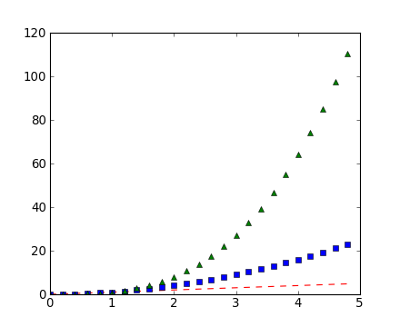
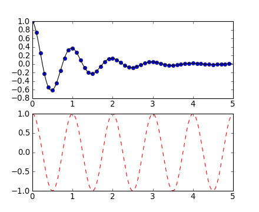

.. include:: ../references.rst

.. NOTES on content for this workshop

   Python concepts
   ----------------
   - scripts / execfile
   - function definition and calling (args, kwargs)
   - Object digression
   - Python types int float str dict tuple list

   Overall: 1d, 2d, 3d plotting with MPL, and intro to APLpy
   Science thread: ???

   1-d
   ---
   - Basic examples: line, scatter, hist
   - Concepts: fig axes, axis ticks (Artist tutorial http://matplotlib.sourceforge.net/users/artists.html)
   - Customization: font size and family, figure size, tick properties
     log / semilog, marker props, line props
   - legend(()
   - Multiple subplits, subplots_adjust, GridSpec
   - Tour of the MPL gallery 
   - Object oriented MPL
   - Alpha opacity for markers and areas
   - Hist(): illustrate function definition w/ custom hist (with lines not bars)

   - Also bar charts ala http://matplotlib.sourceforge.net/users/screenshots.html#bar-charts
     (make bar charts like topcat)

   - GUI image viewer similar to ImgView but with pylab (no classes).  Use to
     illustrate scripts and functions.  (Worth it??)
   - MPL docs (tutorial pages) explaing key concepts

   - Useful bits that might not be obvious
     - Freezing axes autoscale(True/False, axis=x|y|both), 
     - hold(True/False), 
     - interactive on/off (ioff(), plot()..., draw())
     - axis('equal')  axis('scaled'), xlim, ylim
     - Remove ticks and labels (xticks([], []))  
     - locs, labels = xticks(); xticks(locs, [])

   - gca() and gcf(), discussion of stateful plotting

   2-d
   ---
   - imshow()
   - cmap
   - clims

   3-d
   ----
   - mplot3d

.. _`plot()`: http://matplotlib.sourceforge.net/api/pyplot_api.html#matplotlib.pyplot.plot
.. _`axis()`: http://matplotlib.sourceforge.net/api/pyplot_api.html#matplotlib.pyplot.axis
.. _`cla()`: http://matplotlib.sourceforge.net/api/pyplot_api.html#matplotlib.pyplot.cla
.. _`clf()`: http://matplotlib.sourceforge.net/api/pyplot_api.html#matplotlib.pyplot.clf
.. _`title()`: http://matplotlib.sourceforge.net/api/pyplot_api.html#matplotlib.pyplot.title
.. _`gca()`: http://matplotlib.sourceforge.net/api/pyplot_api.html#matplotlib.pyplot.gca
.. _`gcf()`: http://matplotlib.sourceforge.net/api/pyplot_api.html#matplotlib.pyplot.gcf
.. _`subplot()`: http://matplotlib.sourceforge.net/api/pyplot_api.html#matplotlib.pyplot.subplot
.. _`axes()`: http://matplotlib.sourceforge.net/api/pyplot_api.html#matplotlib.pyplot.axes
.. _`xlabel()`: http://matplotlib.sourceforge.net/api/pyplot_api.html#matplotlib.pyplot.xlabel
.. _`ylabel()`: http://matplotlib.sourceforge.net/api/pyplot_api.html#matplotlib.pyplot.ylabel
.. _`text()`: http://matplotlib.sourceforge.net/api/pyplot_api.html#matplotlib.pyplot.text
.. _`setp()`: http://matplotlib.sourceforge.net/api/pyplot_api.html#matplotlib.pyplot.setp
.. _`close()`: http://matplotlib.sourceforge.net/api/pyplot_api.html#matplotlib.pyplot.close
.. _`figure()`: http://matplotlib.sourceforge.net/api/pyplot_api.html#matplotlib.pyplot.figure
.. _`annotate()`: http://matplotlib.sourceforge.net/api/pyplot_api.html#matplotlib.pyplot.annotate
.. _`matplotlib.pyplot`: http://matplotlib.sourceforge.net/api/pyplot_api.html#matplotlib-pyplot

Matplotlib
============

`Matplotlib`_ is a python 2-d plotting library which produces publication quality
figures in a variety of formats and interactive environments across
platforms.  Matplotlib can be used in Python scripts, the Python and IPython
shell, web application servers, and six graphical user interface toolkits.

Documentation
-----------------

The matplotlib documentation is extensive and covers all the functionality you are likely to need.

- `Main matplotlib page <http://matplotlib.sourceforge.net/>`_
- `Pyplot tutorial <http://matplotlib.sourceforge.net/users/pyplot_tutorial.html>`_
- `Interactive navigation
  <http://matplotlib.sourceforge.net/users/navigation_toolbar.html>`_
- `Screenshots <http://matplotlib.sourceforge.net/users/screenshots.html>`_
- `Thumbnail gallery <http://matplotlib.sourceforge.net/gallery.html>`_
- `Text intro <http://matplotlib.sourceforge.net/users/text_intro.html#text-intro>`_

Plotting 1-d data
------------------

The `matplotlib`_ tutorial on `Pyplot
<http://matplotlib.sourceforge.net/users/pyplot_tutorial.html>`_ does such a
good job of covering basic 1-d plotting that there is no need to write a new
version.  **The content below is largely taken from the pyplot tutorial with a
few changes and the addition of exercises.**  Most notably the example code
has been modified assuming the Pylab environment where the `matplotlib.pyplot`_
functions have all been imported already.
:mo

The ``pylab`` mode of `matplotlib`_ is a collection of command style functions
that make `matplotlib`_  work like matlab.  Each ``pylab`` function makes
some change to a figure: eg, create a figure, create a plotting area
in a figure, plot some lines in a plotting area, decorate the plot
with labels, etc....  ``Pylab`` is stateful, in that it
keeps track of the current figure and plotting area, and the plotting
functions are directed to the current axes.  On the 
`matplotlib FAQ <http://matplotlib.sourceforge.net/faq/index.html>`_ page there is a 
very good discussion on 
`Matplotlib, pylab, and pyplot: how are they related? <http://matplotlib.sourceforge.net/faq/usage_faq.html#matplotlib-pylab-and-pyplot-how-are-they-related>`_.

`matplotlib.pyplot`_ is a collection of command style functions that make
matplotlib work like MATLAB.  Each ``pyplot`` function makes some change to a
figure: eg, create a figure, create a plotting area in a figure, plot some
lines in a plotting area, decorate the plot with labels, etc....
`matplotlib.pyplot`_ is stateful, in that it keeps track of the current
figure and plotting area, and the plotting functions are directed to the
current axes::

  import matplotlib.pyplot as plt
  plt.plot([1,2,3,4])
  plt.ylabel('some numbers')
  plt.show()

.. image:: pyplot_simple.png

You may be wondering why the x-axis ranges from 0-2 and the y-axis
from 1-3.  If you provide a single list or array to the
`matplotlib.pyplot.plot` command, matplotlib assumes it is a
sequence of y values, and automatically generates the x values for
you.  Since python ranges start with 0, the default x vector has the
same length as y but starts with 0.  Hence the x data are
``[0,1,2]``.

`plot()`_ is a versatile command, and will take
an arbitrary number of arguments.  For example, to plot x versus y,
you can issue the command::

    plt.plot([1,2,3,4], [1,4,9,16])

For every x, y pair of arguments, there is an optional third argument
which is the format string that indicates the color and line type of
the plot.  The letters and symbols of the format string are from
MATLAB, and you concatenate a color string with a line style string.
The default format string is 'b-', which is a solid blue line.  For
example, to plot the above with red circles, you would issue::

  plt.plot([1,2,3,4], [1,4,9,16], 'ro')
  plt.axis([0, 6, 0, 20])

.. image:: pyplot_formatstr.png

See the `plot()`_ documentation for a complete
list of line styles and format strings.  The
`axis()`_ command in the example above takes a
list of ``[xmin, xmax, ymin, ymax]`` and specifies the viewport of the
axes.

If matplotlib were limited to working with lists, it would be fairly
useless for numeric processing.  Generally, you will use `numpy
<http://numpy.scipy.org>`_ arrays.  In fact, all sequences are
converted to numpy arrays internally.  The example below illustrates a
plotting several lines with different format styles in one command
using arrays::

  # evenly sampled time at 200ms intervals
  t = np.arange(0., 5., 0.2)

  # red dashes, blue squares and green triangles
  plt.plot(t, t, 'r--', t, t**2, 'bs', t, t**3, 'g^')

.. _controlling-line-properties:

Controlling line properties
^^^^^^^^^^^^^^^^^^^^^^^^^^^^

Lines have many attributes that you can set: linewidth, dash style,
antialiased, etc; see :class:`matplotlib.lines.Line2D`.  There are
several ways to set line properties

* Use keyword args::

      plt.plot(x, y, linewidth=2.0)

* Use the setter methods of the ``Line2D`` instance.  ``plot`` returns a list
  of lines; eg ``line1, line2 = plot(x1,y1,x2,x2)``.  Below I have only
  one line so it is a list of length 1.  I use tuple unpacking in the
  ``line, = plot(x, y, 'o')`` to get the first element of the list::

      line, = plt.plot(x, y, '-')
      line.set_antialiased(False) # turn off antialising

* Use the `setp()`_ command.  The example below
  uses a MATLAB-style command to set multiple properties
  on a list of lines.  ``setp`` works transparently with a list of objects
  or a single object.  You can either use python keyword arguments or
  MATLAB-style string/value pairs::

      lines = plt.plot(x1, y1, x2, y2)
      # use keyword args
      plt.setp(lines, color='r', linewidth=2.0)
      # or MATLAB style string value pairs
      plt.setp(lines, 'color', 'r', 'linewidth', 2.0)

Here are the available :class:`~matplotlib.lines.Line2D` properties.

======================  ==================================================
Property                Value Type
======================  ==================================================
alpha			float
animated		[True | False]
antialiased or aa	[True | False]
clip_box		a matplotlib.transform.Bbox instance
clip_on			[True | False]
clip_path		a Path instance and a Transform instance, a Patch
color or c		any matplotlib color
contains		the hit testing function
dash_capstyle		['butt' | 'round' | 'projecting']
dash_joinstyle		['miter' | 'round' | 'bevel']
dashes			sequence of on/off ink in points
data			(np.array xdata, np.array ydata)
figure			a matplotlib.figure.Figure instance
label			any string
linestyle or ls		[ '-' | '--' | '-.' | ':' | 'steps' | ...]
linewidth or lw		float value in points
lod			[True | False]
marker			[ '+' | ',' | '.' | '1' | '2' | '3' | '4'
markeredgecolor or mec	any matplotlib color
markeredgewidth or mew	float value in points
markerfacecolor or mfc	any matplotlib color
markersize or ms	float
markevery               None | integer | (startind, stride)
picker			used in interactive line selection
pickradius		the line pick selection radius
solid_capstyle		['butt' | 'round' |  'projecting']
solid_joinstyle		['miter' | 'round' | 'bevel']
transform		a matplotlib.transforms.Transform instance
visible			[True | False]
xdata			np.array
ydata			np.array
zorder			any number
======================  ==================================================

To get a list of settable line properties, call the
`setp()`_ function with a line or lines
as argument::

  In [69]: lines = plt.plot([1,2,3])

  In [70]: plt.setp(lines)
    alpha: float
    animated: [True | False]
    antialiased or aa: [True | False]
    ...snip

.. _multiple-figs-axes:

Working with multiple figures and axes
----------------------------------------

MATLAB, and `matplotlib.pyplot`_, have the concept of the current
figure and the current axes.  All plotting commands apply to the
current axes.  The function `gca()`_ returns the
current axes (a :class:`matplotlib.axes.Axes` instance), and
`gcf()`_ returns the current figure
(:class:`matplotlib.figure.Figure` instance). Normally, you don't have
to worry about this, because it is all taken care of behind the
scenes.  Below is a script to create two subplots::

  def f(t):
      return np.exp(-t) * np.cos(2*np.pi*t)

  t1 = np.arange(0.0, 5.0, 0.1)
  t2 = np.arange(0.0, 5.0, 0.02)

  plt.figure(1)
  plt.subplot(211)
  plt.plot(t1, f(t1), 'bo', t2, f(t2), 'k')

  plt.subplot(212)
  plt.plot(t2, np.cos(2*np.pi*t2), 'r--')

The `figure()`_ command here is optional because
``figure(1)`` will be created by default, just as a ``subplot(111)``
will be created by default if you don't manually specify an axes.  The
`subplot()`_ command specifies ``numrows,
numcols, fignum`` where ``fignum`` ranges from 1 to
``numrows*numcols``.  The commas in the ``subplot`` command are
optional if ``numrows*numcols<10``.  So ``subplot(211)`` is identical
to ``subplot(2,1,1)``.  You can create an arbitrary number of subplots
and axes.  If you want to place an axes manually, ie, not on a
rectangular grid, use the `axes()`_ command,
which allows you to specify the location as ``axes([left, bottom,
width, height])`` where all values are in fractional (0 to 1)
coordinates.  See :ref:`pylab_examples-axes_demo` for an example of
placing axes manually and :ref:`pylab_examples-line_styles` for an
example with lots-o-subplots.

You can create multiple figures by using multiple
`figure()`_ calls with an increasing figure
number.  Of course, each figure can contain as many axes and subplots
as your heart desires::

    import matplotlib.pyplot as plt
    plt.figure(1)                # the first figure
    plt.subplot(2, 1, 1)         # the first subplot in the first figure
    plt.plot([1,2,3])
    plt.subplot(2, 1, 2)         # the second subplot in the first figure
    plt.plot([4,5,6])

    plt.figure(2)                # a second figure
    plt.plot([4,5,6])            # creates a subplot(111) by default

    plt.figure(1)                # figure 1 current; subplot(212) still current
    plt.subplot(2, 1, 1)         # make subplot(2,1,1) in figure1 current
    plt.title('Easy as 1,2,3')   # subplot 2,1,1 title

You can clear the current figure with `clf()`_
and the current axes with `cla()`_.  If you find
this statefulness, annoying, don't despair, this is just a thin
stateful wrapper around an object oriented API, which you can use
instead (see :ref:`artist-tutorial`)

If you are making a long sequence of figures, you need to be aware of one
more thing: the memory required for a figure is not completely
released until the figure is explicitly closed with
`close()`_.  Deleting all references to the
figure, and/or using the window manager to kill the window in which
the figure appears on the screen, is not enough, because pyplot
maintains internal references until `close()`_
is called.

.. _working-with-text:

Working with text
-------------------

The `text()`_ command can be used to add text in
an arbitrary location, and the `xlabel()`_,
`ylabel()`_ and `title()`_
are used to add text in the indicated locations (see :ref:`text-intro`
for a more detailed example)::

  mu, sigma = 100, 15
  x = mu + sigma * np.random.randn(10000)

  # the histogram of the data
  n, bins, patches = plt.hist(x, 50, normed=1, facecolor='g', alpha=0.75)

  plt.xlabel('Smarts')
  plt.ylabel('Probability')
  plt.title('Histogram of IQ')
  plt.text(60, .025, r'$\mu=100,\ \sigma=15$')
  plt.axis([40, 160, 0, 0.03])
  plt.grid(True)

.. image:: pyplot_text.png

All of the `text()`_ commands return an
:class:`matplotlib.text.Text` instance.  Just as with with lines
above, you can customize the properties by passing keyword arguments
into the text functions or using `setp()`_::

  t = plt.xlabel('my data', fontsize=14, color='red')

These properties are covered in more detail in :ref:`text-properties`.

Using mathematical expressions in text
----------------------------------------

matplotlib accepts TeX equation expressions in any text expression.
For example to write the expression :math:`\sigma_i=15` in the title,
you can write a TeX expression surrounded by dollar signs::

    plt.title(r'$\sigma_i=15$')

The ``r`` preceeding the title string is important -- it signifies
that the string is a *raw* string and not to treate backslashes and
python escapes.  matplotlib has a built-in TeX expression parser and
layout engine, and ships its own math fonts -- for details see
:ref:`mathtext-tutorial`.  Thus you can use mathematical text across platforms
without requiring a TeX installation.  For those who have LaTeX and
dvipng installed, you can also use LaTeX to format your text and
incorporate the output directly into your display figures or saved
postscript -- see :ref:`usetex-tutorial`.

Annotating text
-----------------

The uses of the basic `text()`_ command above
place text at an arbitrary position on the Axes.  A common use case of
text is to annotate some feature of the plot, and the
`annotate()`_ method provides helper
functionality to make annotations easy.  In an annotation, there are
two points to consider: the location being annotated represented by
the argument ``xy`` and the location of the text ``xytext``.  Both of
these arguments are ``(x,y)`` tuples::

  ax = plt.subplot(111)

  t = np.arange(0.0, 5.0, 0.01)
  s = np.cos(2*np.pi*t)
  line, = plt.plot(t, s, lw=2)

  plt.annotate('local max', xy=(2, 1), xytext=(3, 1.5),
              arrowprops=dict(facecolor='black', shrink=0.05),
              )

  plt.ylim(-2,2)
  plt.show()

.. image:: pyplot_annotate.png

In this basic example, both the ``xy`` (arrow tip) and ``xytext``
locations (text location) are in data coordinates.  There are a
variety of other coordinate systems one can choose -- see
:ref:`annotations-tutorial` and :ref:`plotting-guide-annotation` for
details.  More examples can be found in
:ref:`pylab_examples-annotation_demo`.

Plotting 2-d image data
------------------------

Imshow()

Plotting 3-d data
-------------------

Matplotlib >= 1.0.0 required.

.. ###############################

.. admonition:: Digression: Python Objects - or what's with the
   periods everywhere?

   Most things in Python are objects.  But what is an object?

   Every constant, variable, or function in Python is actually a object with a
   type and associated attributes and methods.  An *attribute* a property of
   the object that you get or set by giving the <object_name> + dot +
   <attribute_name>, for example ``img.shape``.  A *method* is a function
   that the object provides, for example ``img.argmax(axis=0)`` or ``img.min()``.

   Use tab completion in IPython to inspect objects and start to understand
   attributes and methods.  To start off create a list of 4 numbers::

     a = [3, 1, 2, 1]
     a.<TAB>

   This will show the available attributes and methods for the Python list
   ``a``.  **Using <TAB>-completion and help is a very efficient way to learn and later
   remember object methods!**
   ::

     In [17]: a.<TAB>
     a.__add__           a.__ge__            a.__iter__          a.__repr__          a.append
     a.__class__         a.__getattribute__  a.__le__            a.__reversed__      a.count
     a.__contains__      a.__getitem__       a.__len__           a.__rmul__          a.extend
     a.__delattr__       a.__getslice__      a.__lt__            a.__setattr__       a.index
     a.__delitem__       a.__gt__            a.__mul__           a.__setitem__       a.insert
     a.__delslice__      a.__hash__          a.__ne__            a.__setslice__      a.pop
     a.__doc__           a.__iadd__          a.__new__           a.__sizeof__        a.remove
     a.__eq__            a.__imul__          a.__reduce__        a.__str__           a.reverse
     a.__format__        a.__init__          a.__reduce_ex__     a.__subclasshook__  a.sort

   For the most part you can ignore all the ones that begin with ``__`` since
   they are generally are internal methods that are not called directly.  At
   the end you see useful looking functions like ``append`` or ``sort`` which
   you can get help for and use::

     a.sort
     a.sort?
     a.sort()
     a

   You can tell the difference between an attribute and a callable method with
   the callable function::

       callable(a.sort)
       [x for x in dir(a) if callable(getattr(a, x)) and not x.startswith('__')]

   *Mention classes and objects as class instances?*
