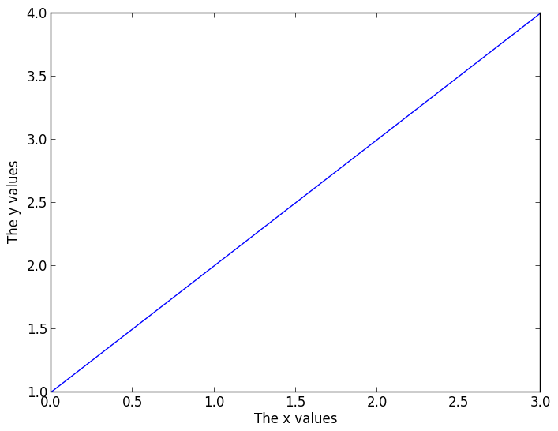
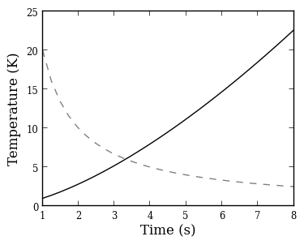

Publication-quality plots
=========================

Here is some advice on how to make your plots 'publication-quality'! The bottom line is that the defaults are often *not* what you want in a publication-quality plot. Design your plot leaving nothing to chance!

Setting the figure size explicitly
----------------------------------

Explicitly set the figure size to the desired final figure size. This ensures
that the fonts for the labels will be the right size compared to the content
of the figure, and also ensures that if the defaults change, your plot will
not. Setting the figure size explicitly also makes it easier to make the axes
have the right aspect ratio if you use ``add_axes``. If you make a plot too
large or too small to start with, the default font sizes will not look good:

.. image:: advanced_plots/publication_1.png
   :scale: 100%
   :align: center

.. image:: advanced_plots/publication_2.png
   :scale: 100%
   :align: center

The following plot has the right size for single-column plots:

.. image:: advanced_plots/publication_3.png
   :scale: 100%
   :align: center

and the following has the right size for full-column plots:

**Note**: the default figure size is not the right size for either
single-column plots, so you will definitely want to change it for this.

Choosing the right font family
------------------------------

Choose the font family ('serif' or 'sans-serif' to match the paper - most of
the time, 'serif' is best)::

    plt.rc('font', family='serif')

    fig = plt.figure(figsize=(4, 3))
    ax = fig.add_subplot(1, 1, 1)
    plt.plot([1, 2, 3, 4])
    ax.set_xlabel('The x values')
    ax.set_ylabel('The y values')

.. image:: advanced_plots/publication_serif.png
   :scale: 100%
   :align: center

Font sizes
----------

Differentiate the font size/style between the axis labels and the tick labels
(by default these are the same, and are set to ``medium``). The tick label
size can often be reduced compared to the default::

    plt.rc('font', family='serif')
    plt.rc('xtick', labelsize='x-small')
    plt.rc('ytick', labelsize='x-small')

    fig = plt.figure(figsize=(4, 3))
    ax = fig.add_subplot(1, 1, 1)
    plt.plot([1, 2, 3, 4])
    ax.set_xlabel('The x values')
    ax.set_ylabel('The y values')

.. image:: advanced_plots/publication_fontsize.png
   :scale: 100%
   :align: center

Colored lines
-------------

Matplotlib uses color for lines by default. However, you should try and use just black/gray curves with line styles unless you *really* need color (don't use a blue line if you have a single curve!)::

    plt.rc('font', family='serif')
    plt.rc('xtick', labelsize='x-small')
    plt.rc('ytick', labelsize='x-small')

    fig = plt.figure(figsize=(4, 3))
    ax = fig.add_subplot(1, 1, 1)

    x = np.linspace(1., 8., 30)
    ax.plot(x, x ** 1.5, color='k', ls='solid')
    ax.plot(x, 20/x, color='0.50', ls='dashed')
    ax.set_xlabel('Time (s)')
    ax.set_ylabel('Temperature (K)')

LaTeX
-----

If you don't *need* LaTeX, don't use it. It is slower to plot, and text looks just fine without. If you need it, e.g. for symbols, then use it.

One of the rc parameters available is ``text.usetex``, which allows Matplotlib to use the system LaTeX installation instead of the built-in one. The system installation generally produces better results, but is quite slow (it may take several seconds to generate the labels for the plot). The parameter can be set in-script with::

    plt.rc('text', usetex=True)

Because of the slower performance, we recommend only enabling this option at the last minute, once you are ready to make the final plot.
